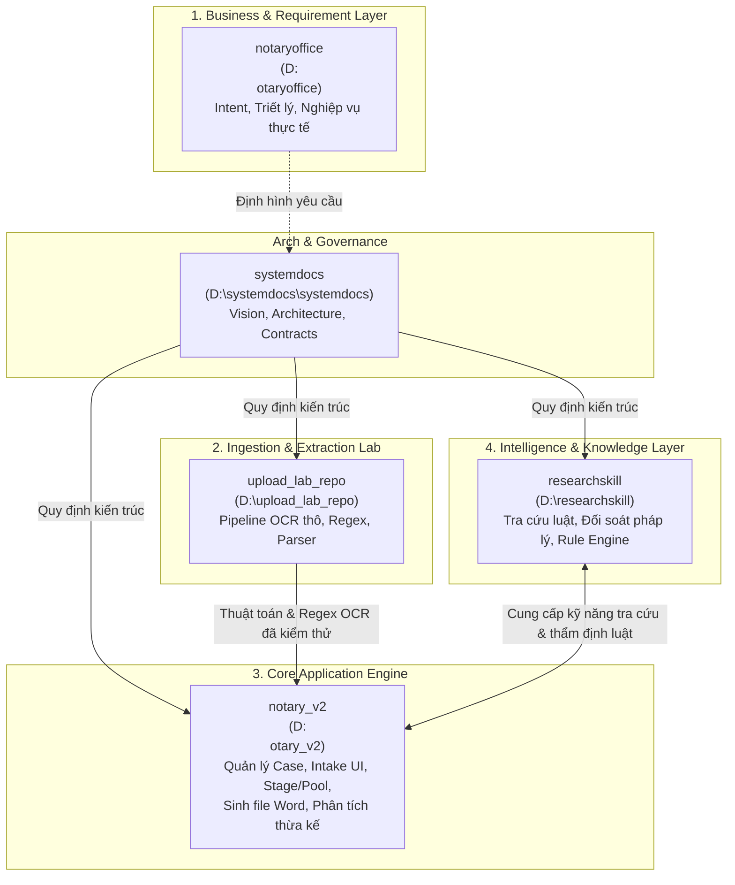

# Sơ Đồ Kiến Trúc Hệ Thống (System Architecture)

Tài liệu mô tả luồng vận hành tổng thể giữa 4 phân hệ chức năng.

---

## Các Luồng Dữ Liệu Chính

1. **Luồng Tiếp Nhận Hồ Sơ (Document Intake Flow)**:
   - Hồ sơ quét/chụp $\rightarrow$ Thử nghiệm & tối ưu tại `upload_lab_repo` $\rightarrow$ Tích hợp vào Document Intake Pipeline của `notary_v2`.
2. **Luồng Nghiệp Vụ & Thẩm Định Pháp Lý**:
   - `notary_v2` tiếp nhận dữ liệu hồ sơ (bên liên quan, bất động sản, giấy chứng tử...) $\rightarrow$ Gọi kỹ năng từ `researchskill` để tra cứu tính hợp lệ theo pháp luật công chứng.
3. **Luồng Sinh Tài Liệu (Output Generation)**:
   - Sau khi case đạt chuẩn thẩm định $\rightarrow$ `notary_v2` tự động sinh văn bản công chứng (file Word) theo mẫu quy định.
