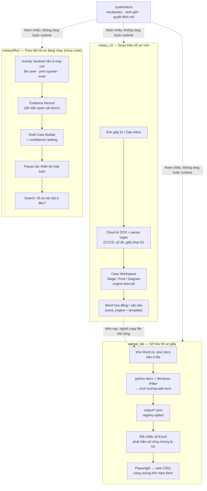

# Kiến trúc hệ thống

## 0. Đọc mục này trước

Đích đến của hệ thống: **một hệ thống thống nhất, database chung, UI chung và
các thành phần chức năng chung được tái sử dụng.** Ba repo là ba đường xử lý
cho ba mục đích khác nhau trong hệ thống đó, sẵn sàng gom thành một repo lớn.
[`COMPONENT_MAP.md`](./COMPONENT_MAP.md) là bản đồ ownership/reuse **draft để duyệt**;
không phải thiết kế vật lý hay quyền thực hiện migration.

**Giai đoạn hiện tại: hai công cụ chạy độc lập, công cụ thứ ba mới có thiết kế.** Việc bây giờ
là làm tốt từng phần, đồng thời **không để chúng phân kỳ** ở bốn chỗ: khóa định
danh ([`contracts/entities.md`](./contracts/entities.md)), lựa chọn công nghệ
([`TECH_STACK.md`](./TECH_STACK.md)), schema/tên trường (`TECH_STACK.md` mục 3),
và ranh giới dữ liệu/provenance (mục 6 dưới đây).

Vì vậy đọc mục 1–3 dưới đây là **hiện trạng**, không phải trạng thái cuối cùng.

## 1. Hiện trạng: chưa có tích hợp giữa các công cụ

Hai nhánh đầu là hiện trạng; nhánh `notaryoffice` là thiết kế, chưa có runtime
(`notaryoffice/AGENTS.md:3,8-14`). Chưa có API **giữa các repo**, chưa có DB
dùng chung, chưa có luồng dữ liệu tự động nào giữa ba công cụ.



Mũi tên nét rời duy nhất giữa hai sản phẩm là **thao tác tay của con người**:
Word do `notary_v2` sinh ra được lưu vào ổ đĩa, và sau đó `upload_lab` quét ổ
đĩa đó như quét bất kỳ Word nào khác. Không có tích hợp code.

## 2. Ai sở hữu dữ liệu gì

Quy tắc chống chồng chéo: mỗi loại dữ liệu có **đúng một** công cụ chủ sở hữu.
Quy tắc này vẫn giữ sau khi gộp DB — dùng chung database **không** có nghĩa là ai
cũng được ghi vào bảng của người khác.

| Dữ liệu | Chủ sở hữu | Ghi chú |
|---|---|---|
| Hồ sơ đang soạn, các bên, tài sản, quan hệ thừa kế | `notary_v2` | `notary.db` |
| Kết quả Cloud OCR giấy tờ + metadata Zalo | `notary_v2` | `notary.db`: bảng `ocr_jobs` và Zalo (`notary_v2/models.py:161-171,186-300`; `database.py:8-24`); file media ở storage backend. `ocr_jobs.db` là broker + result backend Celery mặc định (`celery_app.py:5-11`) |
| Word/hợp đồng sinh ra từ template | `notary_v2` | |
| Trường dữ liệu bóc từ kho Word cũ | `upload_lab` | `output/*.json`, `registry.sqlite3` |
| Trạng thái quét/chuẩn bị/upload lên web tỉnh | `upload_lab` | Ví dụ thật: `matched`, `extracted`, `prepared_dry_run`, `uploaded_success` (`upload_lab_repo/batch_scan.py:364,713,786`; `playwright_uploader.py:81-83`). Snapshot enum và nguồn ở `PROJECTS.md` §2; không phải enum chung xuyên repo |
| Session đăng nhập web tỉnh | `upload_lab` | `nd_storage_state.json` |
| Dấu vết thao tác trên máy con | `notaryoffice` | chưa tồn tại |
| Trạng thái/giai đoạn/người đang giữ hồ sơ đang chạy | `notaryoffice` | chưa tồn tại |

**Hôm nay: không công cụ nào đọc DB của công cụ khác.** Đây là trạng thái của
giai đoạn hiện tại, không phải nguyên tắc vĩnh viễn — đích đến là DB dùng chung.

Nhưng cho tới khi việc gộp được thiết kế và duyệt, mọi dữ liệu chéo phải đi qua
một contract thống nhất trước (`contracts/README.md`). **Agent không được tự mở
kết nối đọc DB của repo khác** vì "dù sao sau này cũng gộp".

Khi gộp thật: quyền **ghi** vẫn thuộc đúng một chủ sở hữu như bảng trên; các công
cụ khác chỉ **đọc**.

## 3. Chồng chéo đã biết — không phải bug, nhưng phải theo dõi

Ba sản phẩm cùng bóc tách thực thể công chứng và đang có **ba cách làm riêng**:

| Việc | `notary_v2` | `upload_lab` | `notaryoffice` (dự kiến) |
|---|---|---|---|
| Nguồn đầu vào | ảnh giấy tờ | file Word | file Word đang sửa |
| Cách lấy text | Cloud AI OCR | `python-docx` + IFilter | IFilter |
| Bóc trường | regex trong `routers/ocr_ai.py` | regex trong `extract_contract.py` | regex phía Central Hub |

Đây là trùng lặp **có chủ ý ở giai đoạn này** — ba nguồn đầu vào khác nhau về
bản chất, hợp nhất sớm sẽ tạo abstraction sai. Nhưng ba nơi cùng định nghĩa "số
GCN hợp lệ là gì" là rủi ro thật: sửa một nơi, hai nơi kia lệch.

**Cách xử lý đã chốt:** giai đoạn này chưa gộp code, nhưng **bắt buộc thống nhất
định nghĩa thực thể** ở `contracts/entities.md`. Ba repo tự implement, cùng tham
chiếu một định nghĩa.

Đây chính là việc quan trọng nhất phải làm đúng từ bây giờ: nếu ba nơi lưu CCCD
theo ba định dạng khác nhau, lúc gộp DB sẽ không join được và phải làm lại toàn
bộ dữ liệu cũ.

## 4. Kiến trúc dự kiến của notaryoffice

Sản phẩm này chưa có code nên toàn bộ mục này là **thiết kế**, không phải hiện
trạng. Nguồn: `notaryoffice/intent.md` (Nguồn Chân lý Duy nhất: quyết định kỹ thuật,
14 bảng DB, Evidence Record, Draft Case).

Mô hình đã chọn: **Hybrid Pipeline — Edge IFilter + Central Processing Hub**

- **Máy trạm (~6 máy):** Sentinel C# .NET 8 siêu mỏng. Bắt file save
  (`ReadDirectoryChangesW`, debounce 3–5 phút), bắt print job (Event ID 307),
  gọi Windows IFilter (`query.dll`) lấy plain text — mục tiêu xử lý cả `.doc` cũ
  và `.docx`; khả năng đọc khi Word đang mở và số đo thời gian vẫn phải kiểm
  chứng trên 6 máy thật (`OPEN_DECISIONS.md` A1). Gửi JSON text
  (20–50KB) về Hub, **không gửi file nhị phân**. Có SQLite FIFO buffer local,
  tự flush khi LAN trở lại.
- **Máy chủ (1 máy/NAS trong văn phòng):** Central Hub — Python FastAPI + DB.
  Lưu `document_snapshots`, tính text diff, chạy regex tất định trên delta, ghép
  print job để phân biệt bản nháp và bản chuẩn ký, dựng Draft Case, phục vụ
  search.
- **Lớp AI:** chỉ vào 10–15% ca mơ hồ (semantic diff, suy luận bàn giao, quét
  hồ sơ chết lâm sàng, dịch câu hỏi tự nhiên thành truy vấn). Phải thay thế
  được, không được giữ trạng thái nghiệp vụ riêng.

Hai tín hiệu xương sống đã chốt:

1. **Word text diff** → biến động thực thể (thêm/sửa CCCD, GCN, thửa/tờ, số
   tiền, diện tích) → cập nhật Case, phát hiện việc phát sinh.
2. **Print spooler** → mức độ hoàn thiện tài liệu. Ý tưởng ban đầu là phân biệt
   `DRAFT_PRINTED` / `FINAL_PRINTED` theo **số bản in** (in 1 bản = soát lỗi; in
   ≥2 bản = bản chuẩn sẵn sàng ký, vì hợp đồng công chứng phải in 3–4 bản).

   ⚠️ **Cách này không dùng được.** Print Spooler **không cung cấp số bản in**
   (`OPEN_DECISIONS.md` A2 — đã chốt = Không). Số bản chỉ suy ra được từ tổng số
   trang, tức là **suy đoán**. Vì vậy phải phân biệt bằng tín hiệu khác: thời
   điểm in so với lần sửa cuối, có sửa file sau khi in hay không, số lần in. Đừng
   thiết kế tính năng nào cần biết chính xác số bản in.

Ba phương án đã **loại bỏ** (đừng đề xuất lại):

- ❌ FileWatcher tập trung trên máy chủ — SMB/NAS trễ, sinh event ảo, không
  định danh được user nào trên máy nào, và bỏ sót 20% file nằm trên ổ máy con.
- ❌ Full edge processing (máy trạm tự diff + tự chạy regex) — biến máy nhân
  viên thành heavy client, và mỗi lần sửa regex phải đi cài lại 6 máy.
- ❌ Tự động ghép cứng 100% theo điểm ≥90 không cần người xác nhận — trùng tên,
  trùng số thửa giữa các xã dẫn tới ghép nhầm hồ sơ.

## 5. Lộ trình đi tới hệ thống thống nhất

Thứ tự bắt buộc là:

```text
ALIGN → POC → ADOPT → CONSOLIDATE
```

### 5.1. ALIGN — giai đoạn hiện tại

Chốt vocabulary, owner quyền ghi, provenance, data states và decision gate công
nghệ ở cấp `systemdocs`. Repo con được tiếp tục sửa lỗi/ổn định hành vi đã có,
nhưng không tự thêm shell, converter, OCR flow hoặc schema mới làm hệ thống phân
kỳ.

Đầu ra ALIGN là tài liệu và issue đã duyệt. **Không có runtime integration** ở
giai đoạn này.

### 5.2. POC — kiểm chứng ranh giới nhỏ nhất

Mỗi giả thuyết được thử độc lập trong phạm vi POC được duyệt; desktop dùng repo
POC tách biệt theo `TECH_STACK.md` §1.1, không sửa app đang chạy. POC có thể dùng
shape `v0.experimental` ở mục 6 để so khả năng hội tụ, nhưng:

- không tạo dependency runtime giữa các repo;
- không thay production adapter;
- không ghi shape experimental vào `contracts/`;
- không coi kết quả chạy được là quyết định công nghệ đã duyệt.

### 5.3. ADOPT — thay adapter, không rewrite nghiệp vụ

Chỉ repo có lợi ích đã đo được mới nhận candidate. Việc adopt phải qua bốn bước
ở `TECH_STACK.md` mục 2, có regression/golden dataset và một task riêng với POC.
Business rules, quyền ghi dữ liệu và bước người dùng xác nhận không đổi chỉ vì
đổi adapter hoặc UI shell.

### 5.4. CONSOLIDATE — hợp nhất khi boundary đã ổn định

Khi contract production đã được hai bên duyệt, mới quyết định package dùng
chung, monorepo và thiết kế vật lý/lộ trình chuyển sang database chung đã định
hướng. Điều kiện để không phải viết lại:

- khóa định danh đã thống nhất;
- cùng một việc không có hai công nghệ production không chủ ý;
- không dùng tính năng riêng của SQLite ở tầng nghiệp vụ;
- ID không trùng giữa các nguồn;
- mỗi loại dữ liệu vẫn có đúng một chủ sở hữu quyền ghi.

Điều kiện chặn mọi bước tích hợp production: cả hai bên phải đồng ý một contract
ghi ở `contracts/` **trước khi** viết code tích hợp. Không agent nào được tự tạo
contract rồi tự implement trong cùng một task.

## 6. Ranh giới hội tụ và shape experimental

**Trạng thái ngày 11/09/2026:** MIN-50 đã duyệt ranh giới và triển khai POC theo
`MIN50_IMPLEMENTATION_SPEC.md` §3/W0. Các shape `v0.experimental` vẫn không phải
contract production. Đã có code conversion POC trong worktree riêng; chưa có
bằng chứng đủ để nghiệm thu golden dataset, chọn candidate hay tích hợp runtime.
Snapshot source/giới hạn kiểm chứng ở `COMPONENT_MAP.md` §2/6.2.

### 6.1. Trạng thái hiện tại và trạng thái dự định

**Hiện tại có:** hai ứng dụng độc lập; PySide6 + Playwright Python ở `upload_lab`;
Qwen OCR và bước Stage/xác nhận ở `notary_v2`; đặc tả Evidence/Draft Case ở
`notaryoffice`.

Các điểm này được kiểm chứng tại:

- Scope upload: `upload_lab_repo/README.md:3`; dry-run/finalize: `:15`;
  bộ đọc Word: `:20-21`; session xuyên suốt: `:32-47`; UI PySide6: `:117`;
  hướng dẫn chạy: `:130-145`. Chromium headed:
  `upload_lab_repo/playwright_uploader.py:896-910`.
- Worker/signals/thread: `upload_lab_repo/ui_qt/workers.py:60-103`;
  command queue và public slots: `:105-117,146-153,210-241`.
- `notary_v2/docs/platform/document-intake/spec.md:14-20,39-53,128-189,224-228`;
  `notary_v2/docs/domains/inheritance/workflow.md:35-55,89`.
- OCR dispatch per-file: `notary_v2/routers/ocr_ai.py:2624-2654`;
  điểm chèn policy gate **dự kiến**, giữa đọc/chuẩn bị ảnh và gọi cloud:
  `_process_single_image` tại `:2450-2459` (helper chuẩn bị `:326`, native call
  `:381-414`). Chưa phải gate đã implement; xem §6.5 về các đường gọi khác.
- `notaryoffice/AGENTS.md:8-14`; `notaryoffice/intent.md:135-144`.

**Tách POC khỏi baseline ứng dụng:** `ConversionEnvelope` và converter/gate đã
có trong worktree `notary_v2/.worktrees/markitdown-qwen-poc` tại
`664edb4`
(`tools/document_conversion_poc/models.py:102-123`, `converter.py:41-101`).
Chưa được xem là component production dùng chung. Không có bằng chứng UI/DB
chung, shared package hay API tích hợp giữa ba repo trong phạm vi nguồn đã
kiểm tra ở `COMPONENT_MAP.md` §2–3. `notaryoffice` vẫn chưa có code
(`notaryoffice/AGENTS.md:3`). Bộ GD-01–07 và benchmark chưa có bằng chứng đạt gate;
không phủ nhận các fixture/unit test POC đã tồn tại.

Riêng baseline `upload_lab`: không có **HTTP server/API surface cho desktop
command**; UI/worker production trao đổi in-process qua Qt signals và command
queue (`upload_lab_repo/ui_qt/workers.py:60-117,146-153,210-241`). DesktopCommand
POC là ngoại lệ có phạm vi riêng: sidecar FastAPI tại worktree POC
(`upload_lab_repo/.worktrees/desktop-command-poc/poc/desktop_command/server.py:9-90`),
không gắn vào app PySide6 đang chạy và không phải production API. Điều này
không có nghĩa repo không gọi HTTP tới web tỉnh.

**Dự định:** dùng các shape dưới đây để viết spec và POC. Chúng chưa phải
contract production, không cam kết tương thích và không cấp quyền triển khai
tích hợp giữa các repo.

### 6.2. Chuỗi trạng thái dữ liệu chung

```text
SOURCE → RAW → NORMALIZED → INFERRED → CONFIRMED
```

| Lớp | Ý nghĩa | Quy tắc quyền ghi |
|---|---|---|
| `SOURCE` | File, ảnh, message hoặc event gốc cùng hash/thời gian/nguồn | Repo thu nhận nguồn sở hữu; không sửa source để che lỗi downstream |
| `RAW` | Text/OCR/event máy thực sự quan sát được cùng provenance | Adapter/provider chỉ tạo kết quả thô; không ghi thành sự thật nghiệp vụ |
| `NORMALIZED` | Giá trị được chuẩn hóa tất định, ví dụ CCCD/GCN theo `contracts/entities.md` | Repo nghiệp vụ sở hữu rule; luôn truy ngược được về RAW |
| `INFERRED` | Candidate, phân loại, confidence hoặc quan hệ do rule/AI suy ra | Không ghi đè RAW/NORMALIZED; phải nêu rule/model và bằng chứng |
| `CONFIRMED` | Business fact được người có thẩm quyền xác nhận; trạng thái kỹ thuật có thể do system-of-record xác nhận | Chỉ repo chủ sở hữu loại dữ liệu đó được ghi; giữ liên kết về bằng chứng |

Các bất biến:

1. Không đi thẳng từ OCR/LLM tới database truth.
2. Sửa normalization/inference không được xóa raw hoặc provenance cũ.
3. Dữ liệu thiếu bằng chứng phải ghi `unknown`/warning, không tự điền theo suy
   đoán.
4. OCR/LLM không được tạo `CONFIRMED` business fact; con người xác nhận cuối.

### 6.3. Ownership xuyên repo

| Phạm vi | Owner nghiệp vụ/quyền ghi | Consumer được phép |
|---|---|---|
| Ảnh/Zalo, OCR giấy tờ, Stage và Case Workspace hiện hành | `notary_v2` | Repo khác chỉ đọc sau contract production |
| Kho Word cũ, extraction, registry và upload lifecycle | `upload_lab` | Repo khác chỉ đọc sau contract production |
| Workstation event, Evidence Record, Draft Case và trạng thái công việc dự định | `notaryoffice` | Chưa có runtime; owner chỉ là thiết kế |
| Vocabulary, shape xuyên sản phẩm và versioning | `systemdocs` | Chỉ quản trị tài liệu; không sở hữu runtime hoặc dữ liệu |

Dùng chung database sau này không thay đổi owner quyền ghi. `ConversionEnvelope`
không biến converter thành owner của Evidence/Case; Evidence không cho phép
`notaryoffice` ghi vào bảng Case Workspace của `notary_v2`.

### 6.4. `DesktopCommand v0.experimental`

Mục đích: kiểm chứng một desktop shell có thể gửi intent tới backend Python mà
không biết internals của `upload_lab`.

Shape tối thiểu của request:

```text
contract_version = "v0.experimental"
command_id        = UUID
command           = start_upload | cancel_upload | scan_document | get_status
requested_at      = ISO-8601 có múi giờ
payload           = object theo command
```

Shape tối thiểu của response/job:

```text
command_id
job_id
status     = accepted | waiting_user | running | failed | completed | canceled
updated_at = ISO-8601 có múi giờ
result     = object | null
error      = { code, message, retryable } | null
```

Ranh giới: UI chỉ gửi lệnh và hiển thị trạng thái; Python vẫn sở hữu session,
business logic, browser thread và Chromium headed. Không gửi credential, cookie
hoặc nội dung hồ sơ qua log/diagnostics. POC không tạo API production.

Transport POC và bảo mật được chốt tại `TECH_STACK.md` §1.1: server loopback
tối thiểu trong repo POC, khởi động riêng, không đụng app PySide6 đang chạy.
Shape ở đây độc lập với transport; queue hiện hành chỉ là điểm tham chiếu
semantics, không phải API có sẵn (`upload_lab_repo/ui_qt/workers.py:105-117,146-153`).
Trạng thái job experimental không phải enum registry nội bộ của `upload_lab`.

### 6.5. `ConversionEnvelope v0.experimental`

Mục đích: mọi converter có thể trả nội dung trung gian cùng provenance mà parser
nghiệp vụ không phụ thuộc trực tiếp vào một thư viện.

```text
ConversionEnvelope
├── contract_version = "v0.experimental"
├── source
│   ├── source_id
│   ├── sha256
│   ├── media_type
│   └── size_bytes
├── converter
│   ├── name
│   ├── version
│   └── config_fingerprint
├── content
│   ├── format = markdown | text
│   └── value
├── segments[]
│   ├── segment_id
│   ├── text
│   └── source_ref
├── ocr_calls[]
│   ├── provider / model / input_hash
│   ├── status / duration_ms
│   └── error
├── warnings[]
└── errors[]
```

`source_ref` chỉ ghi vị trí converter thực sự chứng minh được: page cho PDF,
sheet/cell/range cho XLSX, paragraph/table/relationship cho DOCX. Trang Word
không ổn định theo file DOCX nên không được bịa page number. Khi adapter không
có location đủ tin cậy, ghi `null` kèm warning.

Document Router và OCR gate thuộc orchestration của repo gọi converter:

```text
file
├── PDF có text / DOCX / XLSX ── local conversion
├── .doc cũ ─────────────────── Windows IFilter hiện hành
└── PDF scan / ảnh giấy tờ ──── policy gate ── Qwen nếu được phép
```

OCR gate phải ghi policy/version, lý do cho phép, provider/model được phép và
input hash. Converter hoặc plugin không được tự chọn gửi ảnh nhúng ra cloud.

Điểm chèn tham chiếu ở §6.1 chỉ bao phủ đường `_process_single_image`. Source
còn gọi native OCR ở nhánh tài sản, xoay lại và crop
(`notary_v2/routers/ocr_ai.py:2501,2514,2541`). POC phải chứng minh mọi lần gửi
cloud, kể cả retry/crop/ảnh nhúng, đều nằm trong policy được cấp phép; không
coi gate ở một entrypoint là đã bảo vệ toàn bộ các đường gọi.

### 6.6. Evidence/Domain mapping experimental

`ConversionEnvelope` là bằng chứng kỹ thuật đầu vào, **không phải** Evidence
Record hay Case. Mapping dự định:

```text
SOURCE
  → ConversionEnvelope/RAW
  → extracted facts/NORMALIZED
  → Evidence Record
  → candidate link hoặc Draft Case/INFERRED
  → người dùng xác nhận
  → CONFIRMED state của owner
```

`notaryoffice` sở hữu Evidence Record/Draft Case dự định; `notary_v2` vẫn sở hữu
Case Workspace hiện hành; `upload_lab` vẫn sở hữu registry/upload lifecycle.
Evidence chưa ghép được phải được giữ, không bị loại chỉ vì chưa suy ra Case.

### 6.7. Versioning và đường nâng cấp

- Ba shape trên do `systemdocs` quản trị ở mức vocabulary; runtime owner vẫn là
  repo nghiệp vụ trong bảng 6.3.
- `v0.experimental` được phép breaking change. Mỗi POC phải ghi exact revision
  hoặc issue snapshot đã dùng.
- Không đặt shape vào `contracts/` và không tạo shared package ở giai đoạn này.
- Muốn nâng thành `v1`: hai producer/consumer phải duyệt semantics, error model,
  owner và compatibility; sau đó tạo file trong `contracts/` bằng một task spec
  riêng. Implementation phải là task khác.

### 6.8. Golden dataset chung cho POC

Golden dataset không dùng hồ sơ thật chưa khử dữ liệu. Chỉ dùng dữ liệu tổng hợp
hoặc đã thay toàn bộ định danh; tuyệt đối không có API key, cookie, account hay
ảnh CCCD thật.

| ID | Loại mẫu | Route mong đợi | Provenance tối thiểu |
|---|---|---|---|
| GD-01 | PDF có text | local | page |
| GD-02 | PDF scan | OCR gate → Qwen khi được phép | page + input hash + OCR call |
| GD-03 | DOCX có đoạn/bảng/ảnh nhúng | text local; ảnh chỉ qua OCR gate | paragraph/table/relationship hoặc warning |
| GD-04 | XLSX nhiều sheet/cell/ảnh | cell local; ảnh chỉ qua OCR gate | sheet + cell/range |
| GD-05 | `.doc` cũ | Windows IFilter | file hash + warning nếu không có vị trí |
| GD-06 | Ảnh giấy tờ tổng hợp | OCR gate → Qwen khi được phép | input hash + OCR call |
| GD-07 | File hỏng/không hỗ trợ | lỗi có cấu trúc, không crash batch | error + source hash |

Manifest của mỗi mẫu phải có `sample_id`, SHA-256, media type, mức nhạy cảm,
route mong đợi, facts/text mong đợi và provenance tối thiểu. POC chỉ đạt khi so
được chất lượng, thời gian, lỗi, partial failure và không có cloud call ngoài
route đã duyệt.

Đây là tiêu chuẩn cho bộ mẫu/manifest. Code test/harness bước đầu đã có ở
worktree conversion POC, nhưng chưa chứng minh đủ GD-01–07, expected facts và
provenance (`COMPONENT_MAP.md` §6.2). Duyệt MIN-50 cho POC không phải xác nhận
POC/golden dataset đã đạt; report kỹ thuật chỉ ghi `review_required`, không thay
quyết định của người duyệt.

## 7. Kiến trúc đích — mức ownership & vocabulary

**Dự định, không phải thiết kế vật lý hay lệnh migration:** một hệ thống dùng
chung một database, ba công cụ là ba đường xử lý. Lựa chọn DB theo
`TECH_STACK.md` §3; chưa chốt engine cho DB đích.

- Mỗi bảng có đúng một owner ghi theo phạm vi §6.3. Công cụ khác chỉ đọc qua
  contract đã duyệt; dùng chung DB không cấp quyền ghi chéo.
- Chuẩn hóa tham chiếu theo `contracts/entities.md`, phân biệt định danh
  **người**, **giấy chứng nhận/tài sản** và **hồ sơ**. Không có một thứ bậc khóa
  dùng thay thế lẫn nhau cho cả ba loại.
- CCCD, serial GCN và thửa/tờ/địa phương là bằng chứng để tìm ứng viên hồ sơ,
  không phải khóa chính của Case. Một người hoặc tài sản có thể xuất hiện trong
  nhiều hồ sơ; trùng các giá trị này không đủ để tự gộp hồ sơ.
- Số công chứng là tham chiếu khi đã có, phải xét phạm vi sổ/đơn vị/năm và
  provenance. Trước khi có số, chưa chốt một business key chung duy nhất.

Hai ngữ cảnh cần nối nhưng không được đồng nhất tên gọi:

- `notary_v2`: aggregate soạn thảo hiện có `InheritanceCase`, bảng
  `inheritance_cases` (`notary_v2/models.py:83-103`).
- `notaryoffice`: aggregate theo dõi công việc **dự kiến**, bảng `cases` và
  quan hệ `case_entities` M:N (`notaryoffice/intent.md:365-373`).

Đây là hai aggregate ở hai bounded context có thể cùng liên quan tới một hồ sơ
nghiệp vụ. Chưa chứng minh cardinality giữa chúng, không mặc định 1:1; quan hệ
M:N trong thiết kế `case_entities` cũng không chứng minh cardinality xuyên repo.
Ở mức vocabulary, chỉ cam kết cùng nghĩa của tham chiếu và khả năng xây dựng
liên kết có bằng chứng, không cam kết join trực tiếp hay hợp nhất bảng.

Không ép dùng chung ID ngay, cũng không cấm canonical ID/mapping sau này.
Schema gộp, khóa liên kết cuối cùng, migration và cutover thuộc thiết kế vật lý
được duyệt sau; điều kiện CONSOLIDATE giữ tại §5.4. Các câu hỏi máy thật còn mở
ở `OPEN_DECISIONS.md` A1/A3/A4 không được coi là đã giải quyết bởi mục này.
