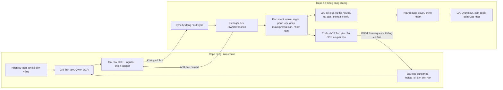

# Zalo Independent Intake — Implementation Plan

Các ô `- [ ]` là danh sách kiểm khi review, không phải trạng thái thực thi. Trạng thái task nằm trên Linear; tiến độ và bằng chứng nằm trong `.agent/tasks/<ID>/`. Không yêu cầu agent/model/skill cụ thể để thực hiện plan.

**Vai trò của file:** hướng dẫn chia việc và thứ tự kiểm chứng, **không phải nguồn yêu cầu mới**. Agent đọc [trang chỉ đường SOT](../../../notary_v2/docs/platform/zalo-document-inbox/README.md), issue Linear được giao, spec hành vi và contract đã duyệt. Khi chi tiết trong plan lệch nguồn chuẩn, sửa plan rồi mới code; các ví dụ schema/API ở đây chỉ là đề xuất cho MIN-92.

**Goal:** Module Zalo chạy độc lập để thu ảnh/tin nhắn và tạo chữ OCR có nguồn; hệ thống Soạn hồ sơ biến dữ liệu đầu vào thành thông tin người, tài sản và nhóm hồ sơ để duyệt và soạn.

**Architecture:** Hai repo nối qua gói JSON raw và API có phiên bản. Module Zalo thu sự kiện, giữ ảnh tạm, tiền xử lý ảnh và gọi Qwen OCR ở nơi có ảnh; nó bàn giao chữ OCR, geometry dòng có kiểu khi provider trả, trạng thái và dấu vết nguồn, không bàn giao ảnh. Document Intake thuộc Soạn hồ sơ dùng chữ và bố cục khi đã xác minh để phân loại giấy, bóc trường, ghép mặt trước/sau, ghép người/tài sản từ nhiều ảnh và gợi ý nhóm hồ sơ sau khi Sync. Khi chữ thiếu, Document Intake có thể gửi yêu cầu OCR bổ sung có giới hạn theo ID nguồn; bot tự xử lý ảnh còn hạn rồi công bố **revision raw mới** qua cùng luồng gói. Máy công chứng giữ gói raw trong thư mục để tra lỗi, kết quả xử lý, lựa chọn người dùng và dữ liệu nghiệp vụ, không phụ thuộc vòng đời bot.

**Tech Stack:** Dùng lại Node.js/zca-js, Python/FastAPI, SQLite và Qwen API từ [TECH_STACK](../../architecture/TECH_STACK.md). Không thêm hàng đợi hay cơ sở dữ liệu mới; hàng công việc ban đầu nằm trong SQLite của module.

**Spec:** [Hành vi Zalo hiện hành](../../../notary_v2/docs/platform/zalo-document-inbox/spec.md) · [Ranh giới tổng thể](../specs/2026-09-24-zalo-independent-intake.md) · [Gói raw/API dự thảo cho MIN-92](../specs/zalo-file-exchange-v1-draft.md). Bản v1 lịch sử chỉ giúp đối chiếu runtime cũ, không là yêu cầu cho v2.

**Goal triển khai:** [MIN-91](https://linear.app/minhnotary/issue/MIN-91). Linear là nơi quản lý yêu cầu, trạng thái và nghiệm thu task. Tài liệu này giữ thiết kế triển khai, điểm nối giữa các agent và cách kiểm chứng; không thay sổ tiến độ trên Linear.

**Quyết định của owner — 24/09/2026:** Parser và quy tắc hiểu tài liệu chạy trong **Soạn hồ sơ**. Giao diện giữa hai repo là gói raw OCR cùng lệnh OCR bổ sung có giới hạn; kết quả người/tài sản/nhóm do Soạn hồ sơ tạo và lưu tại máy chính. Giữ gói raw dạng file để người vận hành xem lại lỗi. MIN-92 duyệt **contract liên repo** để giải phóng MIN-93 scaffold; MIN-103 chuyển engine Zalo hiện có vào module thứ tư, rồi giải phóng MIN-94/95/97. MIN-102 chốt schema/quy tắc nội bộ song song, rồi giải phóng MIN-96. `D:/zalo-intake` và `D:/systemdocs/zalo/` là đích dự kiến, chưa phải repo/folder đã có.

## Global Constraints

- Thứ tự owner chốt: **repo local riêng → hoàn thiện module → thử dữ liệu thật và tối ưu → tích hợp/UI công chứng**. Chưa deploy server hoặc tạo remote repo.
- “Máy chủ/module” là vai trò xử lý độc lập; giai đoạn đầu vẫn chạy trên Windows hiện tại. Đóng app công chứng phải không tắt module; tắt cả máy chạy module thì nó không thể nhận sự kiện.
- Module có code, môi trường, DB, cấu hình và thư mục dữ liệu riêng; không import code, gọi OCR endpoint, đọc DB hoặc chia sẻ media directory của notary.
- Một tài khoản bot văn phòng tham gia nguồn được cho phép. Mỗi tài khoản chỉ một listener hoạt động. Chỉ nhận dữ liệu; không thêm gửi tin hay tự trả lời.
- Qwen OCR, xoay/cắt/tách trang và mọi thao tác cần byte ảnh ở module Zalo. **Regex, phân loại tài liệu, ghép mặt trước/sau, ghép người/tài sản nhiều ảnh và nhóm hồ sơ tạm chạy tại Document Intake của Soạn hồ sơ** sau Sync. Quy tắc xử lý chữ là một bộ dùng được cho nguồn Zalo và upload thủ công. MarkItDown là ứng viên adapter POC, chưa là điều kiện chạy production hoặc thư viện bắt buộc cho luồng này.
- Gói giữa hai repo có **raw OCR text + geometry dòng khi provider trả + provenance** (dấu vết tin/ảnh/trang/dòng/lượt OCR, khung tọa độ và trạng thái xác minh, thời gian, trạng thái OCR và phiên listener). Chiều ngược lại chỉ có lệnh OCR bổ sung đóng dạng `logical_id + variant`, có xác thực/giới hạn; không gửi ảnh hoặc prompt tùy ý từ máy chính. Module không xuất person/property/case result và gói v1 không có `results.json`. Không ảnh, thumbnail, base64 ảnh, đường dẫn hay link tải ảnh đến máy công chứng.
- Với tin/ảnh, `captured_at` là giờ bot lần đầu nhận tin, bất biến qua restart/retry; mọi dòng OCR kế thừa mốc này. Với `listener_session`, đó là giờ module quan sát trạng thái kết nối. `source_sent_at`, `package_ready_at`, `imported_at` là các mốc riêng.
- Ảnh gốc và mọi bản sao/trang PDF/ảnh tạm của module hết hạn ở `captured_at + 168 giờ`; không chờ ACK và không tính lại từ lúc OCR.
- Gói raw chưa ACK được giữ, không xóa theo hạn ảnh. **Trước khi thử dữ liệu thật, MIN-92 chốt chính sách giữ raw sau ACK trên bot với thời hạn và dung lượng hữu hạn**; MIN-102 chốt riêng thời hạn/dung lượng folder gói đã nhập và raw nội bộ tại máy chính, MIN-99 thực hiện, bảo đảm có thể tra lỗi theo yêu cầu owner. Không tự đặt TTL ngắn cho bản máy chính. Raw đã nhập cần đủ để parse lại trong thời hạn nghiệp vụ được duyệt; result/revision chỉ ở Soạn hồ sơ.
- ACK là biên nhận kỹ thuật sau lưu bền vững, không phải người dùng đã duyệt. Sync tự động khi mở/nối lại/định kỳ và nút Sync dùng chung một bộ nhập.
- Mọi lỗi tiếp nhận đã biết, tải ảnh, OCR hoặc giao gói được module ghi trạng thái; lỗi parse, ghép và nhập gói do Soạn hồ sơ ghi trạng thái. Module còn giao lịch sử `listener_session` (kết nối/ngắt/đăng nhập lại/heartbeat cuối) để máy chính đánh dấu khoảng **có thể không nghe được**; không suy ra số tin thiếu. Fallback tìm tin bot chưa từng nhận vẫn ở [MIN-90](https://linear.app/minhnotary/issue/MIN-90), không đưa vào phạm vi này.
- Không tự chốt nghiệp vụ, ghi đè trường đã duyệt, suy ra quan hệ/vai trò pháp lý hay tự sinh hồ sơ/Word. Các nhóm do thuật toán tạo là đề xuất.
- Đọc AGENTS.md và contract trước code. Contract mới và runtime không được triển khai trong cùng task. Không đưa ảnh thật, cookie, key, raw cá nhân hoặc nhãn dữ liệu thật vào Git/Linear/log.

## 1. Luồng chạy và quyền sở hữu



Ví dụ nghiệm thu: 22:00 gửi 10 ảnh khi app công chứng tắt; module vẫn chạy, giữ ảnh tạm và tạo 10 raw OCR/status. Sáng mở app hoặc bấm Sync, máy chính lưu gói raw và **tự chạy Document Intake**, hiển thị “đang phân tích”, rồi hiện các thẻ theo **22:00 lúc bot bắt tin**. Số người/tài sản phải suy từ các mảnh giấy tờ, không lấy số ảnh làm số người. Khi một ảnh lỗi OCR, hiển thị thiếu dữ liệu; 9 ảnh thành công không được ghi thành “đã xử lý đủ 10”.

### 1.1 Ba loại định danh không được nhập làm một

| Loại | Dùng để làm gì | Quy tắc |
|---|---|---|
| Nguồn: message/attachment/page/line | Truy vết chữ lấy từ đâu | ID và captured_at ổn định; gửi lại ảnh trong tin mới là nguồn mới |
| Gói raw: package_id + logical_id/revision | Phân biệt các lần bàn giao cùng ảnh/trang | Producer giữ logical_id và record_id bất biến; gói mới không sửa byte gói cũ |
| Kết quả tại Soạn hồ sơ: result_id + revision | Phân biệt các lần chạy bộ quy tắc và lần có nguồn mới | Consumer tạo và lưu; không nằm trong gói của Zalo |
| Nghiệp vụ: customer/property/case ID | Người dùng đã đưa gì vào phần mềm | Chỉ máy công chứng tạo hoặc liên kết khi người dùng xác nhận |

Producer chỉ định danh tài khoản/cuộc trò chuyện/tin/attachment/trang và revision nguồn; nó không quyết định ảnh nào cùng một hồ sơ. Consumer tạo `processing_scope_id` từ tập source ID đã lưu, mở rộng hoặc tách scope bằng revision kết quả có quan hệ thay thế. Bản đầu chỉ gợi ý nhóm trong cùng tài khoản/cuộc trò chuyện, không ghép chéo các nhóm Zalo vì trùng tên.

### 1.2 Quy cách gói raw và vận chuyển

Gói chứa raw OCR bền vững theo từng ảnh/trang/dòng và metadata nguồn đủ để xử lý lại mà không tải ảnh. ACK của gói nguồn xác nhận **đã lưu raw bền vững**, không có nghĩa trường/người/tài sản đã được trích xuất hay người dùng đã duyệt. Tên schema là đề xuất kỹ thuật để MIN-92 duyệt, không giả là contract đã publish.

- Gói bất biến gồm đúng `manifest.json`, `records.jsonl`, `READY.json`; không yêu cầu hoặc phát `results.json` ở giao diện v1. Schema đề xuất lần lượt là `intake.raw-package.v1`, `intake.raw-record.v1`, `intake.ready.v1`; receipt là `intake.receipt.v1`.
- Mỗi raw record có `record_kind`, `record_id`, `logical_id`, `revision`, `supersedes_record_id`, `captured_at` và `text_lines`. Với tin/ảnh, source key gồm tài khoản/cuộc trò chuyện/message/attachment/page. `record_kind=listener_session` chỉ cần account và ghi `session_id`, trạng thái `connected/disconnected/login_required`, thời điểm quan sát và heartbeat cuối; chat/message/attachment null và record không đi vào parser giấy tờ. `source_sent_at` có thể null; tin chỉ text có `ocr=null`. Với ảnh, `ocr.status` có `succeeded/retry_pending/failed/source_image_expired/unsupported`, model/task/config version và lỗi có mã. Nếu OCR nhiều lượt, `ocr.attempts[]` giữ `ocr_pass_id`, `image_operation`, `region`, khung ảnh thực gửi provider, geometry dòng có kiểu nếu trả về và chữ mỗi lượt; `ocr.selected_pass_ids[]` chỉ các lượt đóng góp vào transcript ngoài. Mỗi dòng thực có `line_id` và `ocr_pass_id` ổn định để parser gắn `source_refs` tới record/lượt OCR/dòng; record lỗi không có dòng vẫn hợp lệ. Shape chi tiết và ví dụ do [draft giao tiếp](../specs/zalo-file-exchange-v1-draft.md) đề xuất để MIN-92 duyệt. Không chuyển provider payload, byte/URL ảnh.
- Gói revision mới tham chiếu `logical_id/revision/supersedes_record_id` rõ ràng; consumer giữ các revision đã nhập. Parser có thể đọc tập raw đã lưu theo `logical_id`, nên gói mới không phải đóng lại mọi ảnh cũ. Mọi `source_refs` của kết quả local phải giải được trong kho raw consumer, không phụ thuộc ảnh còn ở module.
- Local: API có xác thực chỉ bind loopback; URL cấu hình, không hardcode trong JSON. Server thật sau này: HTTPS có xác thực, là task triển khai riêng.
- `GET /intake/v1/packages?delivery=pending&after=0&limit=100` mở mỗi lượt; giữ cùng `until_sequence` khi lấy trang tiếp. Tải manifest/records/ready qua endpoint tương ứng; `POST /intake/v1/receipts` sau lưu raw bền vững. Chu kỳ thử ban đầu 30 giây, nút Sync không tạo lượt trùng.
- `sequence` là thứ tự công bố gói, không phải thời gian tin. Gói OCR xong muộn vẫn có sequence mới. Gói lỗi chưa ACK luôn còn pending cho lượt sau.
- Bản chi tiết API/schema ở [draft giao tiếp](../specs/zalo-file-exchange-v1-draft.md); MIN-92 phải xuất bộ ví dụ hợp lệ/không hợp lệ và hash thật trước code.

### 1.3 Yêu cầu OCR bổ sung và folder raw để kiểm lỗi

`POST /intake/v1/ocr-requests` là lệnh **đóng** từ backend Soạn hồ sơ tới module: body dự kiến có `request_id` UUID, `consumer_id`, `logical_id` ổn định của ảnh/trang đã bàn giao, `observed_revision` consumer đã đọc, `variant` thuộc đúng `rotate | crop_bottom | full_res`, `reason_code` từ danh sách duyệt và `requested_at`. `crop_bottom` chỉ nhận preset vùng dưới ảnh do contract duyệt, ví dụ `bottom_quarter/bottom_third`, không nhận tọa độ tùy ý. Không có bytes ảnh, URL ảnh, prompt tự do, nội dung trường nghiệp vụ hoặc tên file tùy ý. MIN-92 duyệt schema, mã lỗi và bộ ví dụ trước code. Chỉ consumer được xác thực mới gọi được cho `logical_id` thuộc tài khoản/nguồn đã bật. Module không tra lịch sử Zalo hoặc mở nguồn mới theo lệnh này.

- Cùng `request_id` và cùng body chuẩn hóa trả lại cùng job/trạng thái, **không gọi Qwen lần hai**; cùng ID khác body trả `request_conflict`. `observed_revision` cũ bị từ chối với `stale_revision` khi đã có raw revision mới, trừ trường hợp trả job/kết quả đã có. Nếu request khác ID nhưng cùng `(logical_id, variant, preset, OCR config version)` còn queued/running/succeeded, trả job đã có hoặc từ chối trùng theo contract. Chỉ một job OCR bổ sung đang chạy cho một ảnh.
- Kiểm `now < captured_at + 168 giờ` khi nhận **và trước khi đọc ảnh/gọi Qwen**. Quá hạn trả `source_image_expired`; mất file trước hạn trả `source_image_unavailable`; sai nguồn/variant/quyền hoặc hết ngân sách có mã riêng `unknown_source/unsupported_variant/unauthorized/budget_exceeded`. `rate_limited` dành cho giới hạn tạm thời hoặc đồng thời, khác với `budget_exceeded` khi hết ngân sách đã chốt. Không gia hạn bằng retry. Giới hạn đề xuất để MIN-92 chốt trước dữ liệu thật: tối đa **2 biến thể/job OCR bổ sung mỗi khóa quota trong toàn hạn 168 giờ**; MIN-92 phải chọn khóa quota là attachment hay từng trang. Retry lỗi provider có trần riêng và không thể tạo job mới vô hạn. **100 lượt Qwen/consumer/24 giờ** và **2 job đồng thời** chỉ là số thử cho MIN-92 duyệt. Lượt đã gọi Qwen nhưng response thất lạc vẫn tính vào ngân sách gọi. Cần cảnh báo hạn mức và chi phí; không để cấu hình vô hạn.
- `POST` chỉ xác nhận nhận job (`queued/running/completed/rejected`) và ID, không trả OCR như kết quả cuối; `GET /intake/v1/ocr-requests/{request_id}` đọc lại trạng thái qua restart. Yêu cầu bị từ chối ngay vì auth/revision/hạn ảnh/quota chỉ lưu và trả trạng thái theo `request_id`, **không bắt buộc tạo gói raw**. Với job đã được nhận, bot lưu text của lượt OCR bổ sung vào `ocr.attempts[]`, tăng revision của cùng `logical_id`, phát **gói raw mới** qua pending API và giữ gói trước bất biến. Nếu job đã nhận nhưng Qwen hoặc file lỗi/hết hạn, request ledger giữ trạng thái bền vững và bot công bố raw status revision để kiểm toán; không xóa chữ cũ hay bịa chữ thành công. Consumer Sync bản mới, so nguồn, parse lại tại notary và tạo result revision mới; dữ liệu đã duyệt/đã áp dụng chỉ hiện bổ sung để người dùng so sánh, không bị ghi đè.
- Máy chính giữ ba file gói đã nhận trong `data/zalo_exchange/imported/<package_id>/` cùng sổ nhập và raw trong kho parser, để mở lại raw/status/hash khi điều tra lỗi. `staging` và `quarantine` tách riêng; không giữ ảnh/đường ảnh. MIN-92 chốt retention raw sau ACK **ở bot**; MIN-102 chốt riêng thời hạn và hạn dung lượng folder imported/raw **ở máy chính**, MIN-99 thực hiện. Không đặt TTL ngắn làm mất gói owner cần tra lỗi. Gói chưa ACK không áp TTL xóa. Xóa file imported theo chính sách không được làm mất raw đang cần để replay parser/đối chiếu review; nếu hai bản phục vụ mục đích khác nhau thì định nghĩa rõ thời hạn mỗi bản.

**Đích khả năng đọc bố cục giấy cố định:** Qwen `advanced_recognition` cung cấp `ocr_result.words_info` với chữ và vị trí dòng theo [tài liệu Alibaba Cloud Qwen-OCR](https://www.alibabacloud.com/help/en/model-studio/qwen-vl-ocr-api-reference). MIN-95 phải có adapter giữ cấu trúc chữ/vị trí trong raw theo contract MIN-92, bên cạnh transcript text để các luồng cũ vẫn đọc được. MIN-96 tại Soạn hồ sơ mới dùng vị trí tương đối, nhãn và dòng lân cận để hiểu mẫu CCCD/GCN; bot không tự chọn trường nghiệp vụ. **Chưa bật mặc định chỉ từ tài liệu:** MIN-98 phải chứng minh độ đúng và hệ tọa độ trên dữ liệu có nhãn trước quyết định rollout. Code hiện hành chỉ gọi `text_recognition`, chuẩn bị ảnh bằng EXIF transpose/resize và đôi khi crop/xoay; vì vậy vị trí phải gắn với từng lượt OCR, ảnh/trang và kích thước khung ảnh thực gửi Qwen. MIN-92 chốt kiểu tọa độ/quad, gốc/đơn vị, kích thước, thao tác EXIF/crop/resize/rotate và tình trạng chuyển tọa độ về ảnh gốc. Khi chưa kiểm được phép chuyển, giữ nguyên tọa độ provider cùng metadata khung/lượt OCR và cờ ánh xạ chưa xác minh; chưa dùng chúng như tọa độ của khung gửi hoặc ảnh Zalo. Không đưa ảnh/URL ảnh/provider payload thô sang máy chính. Không chuyển `key_information_extraction` sang bot hoặc đổi model production chỉ vì có API.

## 2. Bản đồ tách code đã kiểm chứng

Các đường dẫn dưới đây tồn tại trong `D:/systemdocs` lúc lập plan; số dòng là mốc tra cứu, agent phải đối chiếu lại HEAD trước sửa.

| Nguồn hiện tại | Cách dùng khi tách |
|---|---|
| `notary_v2/zalo_connector/` | Chuyển connector, lockfile và test sang repo riêng. Node hiện khai báo >=20, zca-js 2.1.2; chưa nâng phiên bản trong lần tách |
| `notary_v2/routers/zalo_inbox.py:64`, `main.py:44` | Process hiện gắn vòng đời app. Thay bằng bộ chạy độc lập ở module; chỉ gỡ móc khởi động/dừng cũ khi chuyển đổi đạt nghiệm thu |
| `notary_v2/services/zalo_inbox.py:108` | Tách phần account/source/receive/cache/job sang module, bỏ phụ thuộc session/model của notary |
| `notary_v2/models.py:173`, `database.py:111` | Sáu model Zalo hiện có là dữ liệu legacy. Module tạo DB riêng; không dùng chung file DB hoặc tự xóa bảng cũ |
| `notary_v2/routers/ocr_ai.py:322`, `:377`, `:2477` | Dùng lại phần chuẩn bị ảnh/gọi Qwen ở module; kiểm đường OCR ảnh xoay/vùng cuối hiện có để đo parity. Các dấu hiệu nghiệp vụ quyết định cứu ảnh vẫn thuộc parser notary, không chép sang bot; parser có thể đề nghị bot OCR lại qua lệnh đóng §1.3 khi ảnh còn hạn, nhưng không tự mở ảnh. |
| `notary_v2/routers/ocr_ai.py:452`, `:797` | Giữ và rút logic bóc trường người/tài sản thành Document Intake dùng chung **trong notary**, không sao chép parser sang repo Zalo |
| `notary_v2/routers/ocr_ai.py:2024`, `:2206` | Ghép tài sản hai mặt/người hiện tại là baseline của Document Intake; mở rộng để ghép nhiều ảnh và giữ xung đột tại Soạn hồ sơ |
| `notary_v2/services/zalo_inbox.py:887`, `:1458` | Batch hiện do người dùng chọn ảnh; confirm hiện xuất JSON/Excel. Chưa phải tự nhóm hồ sơ hoặc nhập case |
| `notary_v2/frontend/static/js/zalo_inbox.js:141`, `:164`, `:407` | UI hiện dựa ảnh/URL ảnh và vùng JSON. Thay bằng kết quả text, thẻ và duyệt; không giữ endpoint ảnh cho luồng mới |
| `notary_v2/frontend/templates/cases/form.html:10612`, `:11682` | Có UI OCR/Stage để tham khảo; `case_state_json.stage` được Word dùng trực tiếp nên không lưu đề xuất Zalo chưa xác nhận ở đây |
| `notary_v2/routers/customers.py:427` | inline_create có thể cập nhật khách theo CCCD, cả trường rỗng. Không gọi mù từ Sync hoặc apply bot |
| `notary_v2/routers/cases.py:801`, `:1431` | `/stage-update` ghi `case_state_json` ngay; thao tác Cập nhật từ dữ liệu Zalo cần transaction riêng có kiểm version/khóa |
| `notary_v2/services/word_engine.py:404` | Sinh Word đọc `case_state_json.stage` trực tiếp; dữ liệu Zalo chưa được người dùng bấm Cập nhật phải ở DraftInput riêng |

**Giữ OCR tải ảnh thủ công trong notary:** `routers/ocr_ai.py` còn được form gọi cho người và tài sản. MIN-103 chuyển toàn bộ primitive do Zalo sở hữu: connector, account/session/listener, journal, media, worker và phần chuẩn bị ảnh/gọi Qwen; các hàm regex/bóc trường/ghép được tách thành Document Intake **ngay trong notary** để đầu vào Zalo và upload thủ công dùng cùng quy tắc. Source map ghi file/symbol, commit, manifest và test tương ứng ở repo Zalo, snapshot `zalo/` và notary; không tạo import xuyên repo, symlink, DB/media/session chung hoặc nested `.git`/submodule tự phát. Chỉ bỏ phần thu nhận/xử lý ảnh Zalo legacy khi cắt luồng cũ ở MIN-101. MarkItDown hiện là adapter POC có thể nối vào Document Intake khi có contract phù hợp, chưa phải phụ thuộc runtime của kế hoạch này.

## 3. Cấu trúc file dự kiến và điểm nối nội bộ

Các file trong mục này là **sẽ tạo**, không phải mô tả runtime đã tồn tại. `D:/zalo-intake` là repo local riêng đề xuất; `D:/systemdocs/zalo/` là snapshot module thứ tư trên nhánh monorepo tích hợp, không tạo trên `main` tài liệu. MIN-93 chốt repo nào là nguồn chính; MIN-103 ghi commit/manifest/checksum và cơ chế cập nhật một chiều để hai bản không phân kỳ. Nội dung `zalo/` không có `.git` lồng hoặc submodule nếu chưa có quyết định riêng. DB, ảnh, cookie/session, key và runtime của hai sản phẩm không dùng chung.

```text
D:/zalo-intake/
  connector/                   # Node listener, journal và media downloader
    src/  test/  package.json  package-lock.json
  src/zalo_module/
    app.py  settings.py  database.py  cli.py  types.py
    intake/journal.py          # Nhập journal, chống trùng nguồn
    storage/media.py           # Đường dẫn chỉ nội bộ module
    storage/retention.py       # Hạn 168 giờ của mọi bản ảnh
    jobs/worker.py             # Trạng thái công việc, lease/retry
    ocr/qwen.py                # Qwen -> text, không sửa dữ kiện
    ocr/variants.py            # Chạy OCR thêm trên ảnh nội bộ, phần MIN-95
    ocr/request_ledger.py      # Khóa nguồn/hạn mức/idempotency, phần MIN-97
    delivery/package.py  ledger.py
    api/intake.py  ocr_requests.py
  schemas/                     # Bản contract đã duyệt, có version/hash
  tests/unit/  tests/integration/  tests/fixtures/synthetic/
  docs/                       # SOT producer sau MIN-103: extraction-map, runbook, eval protocol, spec
  runtime/                     # Gitignore; DB, session, ảnh, raw, outbox
  pyproject.toml  .env.example  .gitignore  run.bat  verify.ps1
```

```text
D:/systemdocs/notary_v2/                  # Các file sau là dự kiến sẽ tạo/sửa
  services/document_intake/
    raw_types.py                         # Nguồn chữ dùng chung, không có ảnh
    classify.py  person.py  property.py  # Regex, loại giấy, field candidates
    pair_sides.py                        # Nối trước/sau giấy tờ theo chứng cứ
    assemble_persons.py  assemble_properties.py  group_cases.py
    result_store.py                      # Result/revision local, nguồn và lỗi
  services/zalo_raw_import.py  services/zalo_raw_sync.py
  services/zalo_ocr_requests.py           # Lệnh đóng theo logical_id
  routers/zalo_raw_inbox.py
  tests/test_document_intake_*.py  tests/test_zalo_raw_*.py
  tools/evaluate_document_intake.py      # Replay raw package ngoại tuyến cho MIN-98
```

Không tạo thư mục ảnh thử bên trong repo công chứng. Dùng `runtime/media` riêng của module, ngoài vùng OneDrive/chia sẻ; ảnh fixture thật cũng tuân hạn 7 ngày. Raw/nhãn cá nhân trong kho riêng được bảo vệ, không commit. JSON giả lập được commit sau kiểm tra không có dữ liệu thật. `Document Intake` nhận một đầu vào chữ chung; adapter Zalo raw ở MIN-99, adapter upload thủ công đang có được giữ hoặc bọc lại mà không đổi hành vi OCR hiện tại.

Tài liệu producer hiện ở `notary_v2/docs/platform/zalo-document-inbox/` chỉ là SOT tạm lúc lập kế hoạch. Trong MIN-103, chuyển quy tắc connector/ảnh/Qwen/giao raw sang `zalo/docs` của repo Zalo và snapshot monorepo. Sau đó spec notary chỉ giữ Sync, parser, review và áp dụng; contract liên repo ở `contracts/`. Không giữ hai bản CAP producer để sửa độc lập.

### 3.1 Kiểu và hàm đề xuất để agents ghép được code

MIN-92 chốt ý nghĩa; MIN-93 khai báo kiểu trong `types.py`. Dưới đây là tên kỹ thuật dự kiến, nếu review đổi tên phải sửa mọi task dùng nó trước bàn giao:

```python
from datetime import datetime
from pathlib import Path
from typing import Any, TypedDict

JsonObject = dict[str, Any]
CaptureEvent = JsonObject   # journal schema nội bộ, có captured_at + source key
RawRecord = JsonObject     # validate bằng intake.raw-record.v1
RawPackage = JsonObject    # manifest và bytes records/READY đã kiểm
ParsedDocument = JsonObject  # loại giấy + field candidates + source_refs, local
ProcessedResult = JsonObject # người/tài sản/nhóm + revision, chỉ local

class ImportReceipt(TypedDict):
    package_id: str
    manifest_sha256: str
    status: str
    imported_at: str

# Module: adapter Qwen trả records cho từng trang, kể cả status lỗi.
def capture_event(event: CaptureEvent) -> str: ...  # ID bền vững; replay trả cùng ID
def ocr_attachment(attachment_id: str) -> list[RawRecord]: ...
def submit_ocr_request(request_id: str, consumer_id: str, logical_id: str,
                       observed_revision: int, variant: str,
                       preset: str | None, reason_code: str,
                       requested_at: datetime) -> JsonObject: ...
def run_ocr_variant(logical_id: str, variant: str, preset: str | None) -> RawRecord: ...  # nội bộ bot, MIN-97 chỉ gọi từ job đã duyệt
def publish_package(records: list[RawRecord], consumer_id: str) -> str: ...
def expire_media(now: datetime) -> int: ...        # số tệp đã xóa, không xóa raw

# Notary: Document Intake chỉ nhận chữ OCR và nguồn, không nhận byte ảnh.
def parse_records(records: list[RawRecord]) -> list[ParsedDocument]: ...
def assemble_result(scope_id: str, documents: list[ParsedDocument]) -> ProcessedResult: ...
def replay_raw(scope_id: str, raw_revision_ids: list[str], rule_version: str) -> ProcessedResult: ...
def propose_ocr_request(result_id: str, logical_id: str,
                        variant: str, reason_code: str) -> JsonObject: ...  # notary
def import_package(directory: Path) -> ImportReceipt: ...
def preview_apply(review_id: str, target_case_id: int | None) -> JsonObject: ...
def stage_review(review_id: str, target_case_id: int | None,
                 operation_id: str) -> JsonObject: ...  # chỉ lưu DraftInput
def commit_draft_input(draft_id: str, target_case_id: int,
                       expected_target_fingerprint: str,
                       operation_id: str) -> JsonObject: ...  # thao tác Cập nhật
```

Các dấu `...` trên là khai báo giao diện trong **plan**, không phải yêu cầu commit stub chưa làm. Agent cung cấp triển khai và test của phần mình. Runtime phải kiểm schema đầy đủ, không coi `dict` là đã kiểm dữ liệu.

### 3.2 Danh sách việc và thứ tự giao

MIN-92 chỉ chốt **contract liên repo**: gói raw, ACK, OCR bổ sung và listener_session. Nó giải phóng MIN-93 để dựng scaffold. [MIN-103](https://linear.app/minhnotary/issue/MIN-103) chuyển baseline engine Zalo và tài liệu producer vào repo riêng cùng `zalo/` sau MIN-93, rồi giải phóng MIN-94/95/97. [MIN-102](https://linear.app/minhnotary/issue/MIN-102) chốt riêng result/revision/DraftInput/fingerprint/nhiều thửa **và chính sách giữ gói đã nhập ở máy chính** sau MIN-92, song song MIN-93/103/94/95/97; MIN-96 bắt đầu sau MIN-102 và chạy ngoại tuyến trước Sync. MIN-98 dùng parser không giao diện và gói raw thật để thử/tối ưu trước MIN-99 nhập tự động và MIN-100 làm UI.

| Task | Agent phụ trách | Điều kiện được bắt đầu code | Kết quả dùng cho bước sau |
|---|---|---|---|
| [MIN-92](https://linear.app/minhnotary/issue/MIN-92) | Contract liên repo | Có spec hiện hành | Gói raw/ACK/OCR bổ sung/listener_session, fixtures, chính sách raw sau ACK được duyệt |
| [MIN-102](https://linear.app/minhnotary/issue/MIN-102) | Contract nội bộ Soạn hồ sơ | MIN-92 | Result/revision, DraftInput, fingerprint, nhiều thửa và retention máy chính được duyệt |
| [MIN-93](https://linear.app/minhnotary/issue/MIN-93) | Scaffold repo Zalo | MIN-92 | Repo độc lập có entrypoints/config/DB, replay giả lập |
| [MIN-103](https://linear.app/minhnotary/issue/MIN-103) | Chuyển engine Zalo baseline | MIN-93 | Repo riêng + `zalo/` snapshot cùng manifest; connector/session/media/Qwen primitives/tests/tài liệu producer; không chuyển parser notary |
| [MIN-94](https://linear.app/minhnotary/issue/MIN-94) | Tiếp nhận | MIN-103 | Ghi nhận bền vững, lifecycle, hạn ảnh |
| [MIN-95](https://linear.app/minhnotary/issue/MIN-95) | Zalo OCR | MIN-103 | Raw OCR có trạng thái, nguồn và text_lines; không field nghiệp vụ |
| [MIN-96](https://linear.app/minhnotary/issue/MIN-96) | Document Intake tại notary | MIN-102 | Phân loại/bóc trường/ghép mặt, người, tài sản và nhóm tạm từ raw fixtures; replay ngoại tuyến |
| [MIN-97](https://linear.app/minhnotary/issue/MIN-97) | Zalo gói raw/API | MIN-103; dùng fixture contract để làm song song | Gói raw bền vững, pending và ACK |
| [MIN-98](https://linear.app/minhnotary/issue/MIN-98) | Đánh giá hai engine không UI | MIN-94 + MIN-95 + MIN-96 + MIN-97 | Live capture/OCR/gói raw rồi replay Document Intake; báo cáo dữ liệu thật và tối ưu |
| [MIN-99](https://linear.app/minhnotary/issue/MIN-99) | Notary Sync gói raw | MIN-98 | Import raw, chạy parser local idempotent, giữ result/revision; không tự ghi nghiệp vụ |
| [MIN-100](https://linear.app/minhnotary/issue/MIN-100) | UI/đầu vào hồ sơ | MIN-99 | Duyệt và áp dụng vào bản nháp hồ sơ |
| [MIN-101](https://linear.app/minhnotary/issue/MIN-101) | Kiểm thử/chuyển đổi | MIN-100 | Hai repo hoạt động cùng nhau, tắt đường Zalo cũ an toàn |

Có thể chạy song song MIN-102 và MIN-93 sau khi MIN-92 duyệt contract liên repo. MIN-103 theo sau scaffold; 94/95/97 chỉ bắt đầu sau khi migration đối chiếu xong source, tests và ownership. MIN-96 làm ở repo notary từ raw fixture MIN-92 cùng result contract MIN-102, không chạm code module; khi MIN-95 sinh raw thật, dùng nó để kiểm tương thích trước MIN-98. Không cho hai người cùng sửa `app.py`, `database.py` hoặc cùng file migration: người phụ trách repo điều phối tích hợp các phần này; mỗi phần có migration/test riêng có số thứ tự. Chỉ một người chốt commit tích hợp. UI có thể đọc spec trước nhưng triển khai sau báo cáo MIN-98 đúng thứ tự owner yêu cầu.

## 4. Các gói triển khai cho agents

### MIN-92 — Contract liên repo: raw, OCR bổ sung và phiên listener

**File dự kiến:** hoàn thiện draft hiện có; sau owner duyệt tạo `contracts/zalo-intake.md`, `contracts/zalo-intake/{manifest,raw-record,ready,receipt,ocr-request,ocr-request-response}.schema.json`, `contracts/zalo-intake/examples/{valid,invalid}/`, `contracts/zalo-intake/validate_examples.py`. Cập nhật `contracts/README.md`. Chỉ mô tả trao đổi hai repo; schema kết quả và bridge nghiệp vụ thuộc MIN-102. Không viết runtime trong task này.

**Consumes:** spec chính và chuẩn định danh trong `contracts/entities.md`. **Produces:** schema/version raw package, ACK, `POST /intake/v1/ocr-requests`, listener_session, bytes ví dụ/hashes thật, mã lỗi ổn định và chính sách lưu raw sau ACK; phân biệt validator cấu trúc với quy tắc nhiều record/trạng thái.

- [ ] Ghi rõ quyết định owner: Zalo nhận/tạm giữ ảnh, tiền xử lý và Qwen OCR; Soạn hồ sơ chạy một Document Intake chung cho raw Zalo và chữ từ OCR upload thủ công. MarkItDown là adapter POC tùy chọn, không chặn sản phẩm. Sửa spec/Linear issue còn ghi parser/result ở Zalo rồi mới duyệt contract.
- [ ] Chốt `intake.raw-package.v1`, `intake.raw-record.v1`, `intake.ready.v1`, `intake.receipt.v1`, UUID, thời gian có múi giờ, `record_id/logical_id/revision/supersedes_record_id`, `ocr.attempts[].ocr_pass_id/image_operation/region`, `ocr.selected_pass_ids[]`, `line_id` và `ocr_pass_id` trên dòng OCR có chữ, status OCR, provenance, hash và giới hạn bytes. `message_text` và `listener_session` có `ocr=null`; image status có các giá trị §1.2. Không có `results.json` trong gói v1.
- [ ] Theo [draft giao tiếp](../specs/zalo-file-exchange-v1-draft.md), chốt raw geometry có kiểu cho mỗi dòng của mỗi OCR pass: provider `words_info.text/location` (8 số theo thứ tự góc được tài liệu xác nhận), `rotate_rect` khi có, `element_index` do module gán từ vị trí phần tử trong mảng provider, ID trang/ảnh/khung, chiều rộng/cao ảnh thực gửi Qwen, gốc tọa độ, quy ước đơn vị và trạng thái geometry có hoặc thiếu. `element_index` chỉ giữ provenance, không được coi là thứ tự đọc. Ghi chuỗi thao tác ảnh phía client (EXIF, crop, resize, rotate), tham số đủ để thử chuyển khung tọa độ; tọa độ ảnh nguồn chỉ xuất khi phép chuyển đã được xác minh. Chốt giới hạn kích thước/số dòng, validator số hữu hạn/trong khung và fixture text-only, ảnh xoay, crop chân, nhiều trang; không bịa tọa độ khi provider thiếu. Việc Qwen có tự resize/rotate nội bộ và nghĩa chính xác của `rotate_rect` cần kiểm trên response thực trong MIN-95/98 trước khi dùng để suy vị trí ảnh nguồn.
- [ ] Chốt `listener_session` qua restart: connected/disconnected/login_required, session ID, giờ quan sát và heartbeat cuối. Nếu process chết không kịp ghi disconnected, đánh dấu khoảng có thể không nghe được từ heartbeat cuối đến lần connected mới kèm độ bất định; không khẳng định tin nào đã mất hoặc Zalo thật không có tin.
- [ ] Chốt lệnh OCR bổ sung §1.3: `logical_id`, `observed_revision`, đúng ba variant, preset đóng cho `crop_bottom`, request ID idempotent, auth theo consumer và source scope; request trùng không gọi Qwen hai lần. Dùng mã `source_image_expired/source_image_unavailable/unknown_source/unsupported_variant/budget_exceeded/rate_limited/stale_revision/unauthorized/request_conflict/provider_failed`; từ chối ngay chỉ cần trạng thái request, job đã nhận nhưng lỗi phải công bố raw status revision để kiểm toán. Chốt khóa quota là attachment hay từng trang, số job/biến thể bổ sung cho khóa đó trong 168 giờ, retry provider riêng có trần, ngân sách Qwen mỗi consumer/ngày và số job đồng thời trước dữ liệu thật; ảnh hết hạn ở 168 giờ tính từ captured_at dù job đã xếp hàng.
- [ ] Chốt thời hạn **và hạn dung lượng** lưu raw package sau ACK ở bot, cách báo gần đầy và dọn package đã ACK. Gói chưa ACK phải giữ bền vững. Chính sách folder imported và raw replay ở máy chính thuộc MIN-102, MIN-99 thực hiện; owner cần giữ file để tra lỗi nên không đặt TTL ngắn khi chưa duyệt.
- [ ] Viết fixtures giả: hai mặt căn cước; một GCN ba trang hai thửa; hai người cùng tên khác CCCD; tin chỉ text; OCR lỗi một trang; dữ liệu đến muộn; revision mới có xung đột.
- [ ] Viết fixtures từ chối: ảnh/base64/link ảnh; thiếu `captured_at` hoặc `line_id` trên dòng OCR có text; cùng ID khác hash; path thoát folder; revision nguồn cũ nhưng byte thay; receipt sai consumer/hash/count; `results.json` hoặc file lạ. Thêm OCR request sai variant/preset/nguồn/quyền, duplicate ID khác body, observed_revision cũ, hết hạn trước và sau enqueue, vượt hạn mức; listener crash không có disconnected.
- [ ] Validator cấu trúc kiểm shape; validator quan hệ kiểm nguồn/đếm/revision. Contract có bảng chuyển trạng thái cùng fixture/validator **thuần dữ liệu** để kiểm tổ hợp hợp lệ và sai. Test chạy DB/replay/ACK/OCR request và cleanup thật thuộc MIN-97/99; JSON Schema một mình không chứng minh được hành vi runtime.
- [ ] Trình bộ contract raw cùng ví dụ và diff cho owner duyệt theo `contracts/README.md`; publish ở task này rồi mới giải phóng MIN-93. Duyệt kiến trúc hiện tại không thay chữ ký contract kỹ thuật chưa có.

Phép thử validator phải có kết quả thực:

```python
valid = load_example("valid/two_sides")  # helper của validate_examples.py đọc bộ file
assert validate_package(valid) == []
invalid = load_example("invalid/manifest_hash_mismatch")
assert "manifest_hash_mismatch" in validate_package(invalid)
request = load_example("invalid/ocr_request_unknown_variant")
assert "unsupported_variant" in validate_ocr_request(request)
```

Chạy từ `D:/systemdocs`: `python contracts/zalo-intake/validate_examples.py`. Báo số valid/invalid, lỗi mong đợi và contract revision; không chạy listener hay Qwen.

### MIN-102 — Contract nội bộ Document Intake và đầu vào soạn hồ sơ

**Files trong `notary_v2/`:** tạo `docs/platform/document-intake/zalo-result-bridge.md`, cập nhật `docs/platform/document-intake/spec.md` và `docs/platform/zalo-document-inbox/spec.md`; dùng fixtures raw đã duyệt ở MIN-92 để minh họa result. Không thay contract liên repo; không viết parser/apply runtime trong task này.

**Consumes:** raw contract MIN-92 và model Customer/Property/Case hiện tại. **Produces:** schema/result revision nội bộ có field candidates/source_refs/conflicts, quy tắc DraftInput → Cập nhật, ánh xạ §5 và chính sách giữ gói imported/raw tại máy chính đủ để tra lỗi và replay. Chặn MIN-96; phải được duyệt trước MIN-99/100.

- [ ] Chốt `result_id/revision/processing_scope_id/rule_version/raw_revision_set`, source_refs đến `record_id/page/ocr_pass_id/line_id` đã nhập, quan hệ result đến muộn với review đã lưu. Kết quả parse lại từ OCR bổ sung là bản mới để so, không sửa bản đã xác nhận.
- [ ] Chốt semantics raw import → parser local → user review → DraftInput → **Cập nhật**; lưu operation_id, result revision, từng field choice và quyết định gộp/tách. Gói đến, parser chạy hoặc lưu DraftInput không sửa Customer/Property/case_state_json; Stage là dữ liệu Word có thể đọc ngay.
- [ ] Chốt `expected_target_fingerprint`: SHA-256 của biểu diễn JSON ổn định từ trường hồ sơ, `case_state_json`, quan hệ và Customer/Property mà preview đọc/sửa. Với case mới dùng marker `new_case`; trong transaction Cập nhật lấy khóa SQLite, đọc lại và so hash trước ghi. Một sửa qua router cũ sau preview phải trả `target_changed` và không ghi nửa chừng; nếu dùng cột version thì mọi đường viết liên quan phải tăng version.
- [ ] Chốt tài sản **nhiều thửa**: `result.properties[].land_rows` giữ từng thửa. `Property.land_rows_json` hiện là dòng loại đất/diện tích/thời hạn, còn `so_thua_dat/so_to_ban_do` là scalar. Định nghĩa model nhiều thửa mới hoặc giữ toàn bộ trong DraftInput khi chưa map đúng; không mất thửa phụ.
- [ ] Chốt thời hạn/dung lượng giữ gói raw đã nhập và raw dùng để replay trên máy chính, cách cảnh báo và dọn; bảo đảm yêu cầu owner mở file tra lỗi. Đây là chính sách consumer, không áp thẳng TTL raw sau ACK ở bot từ MIN-92.
- [ ] Duyệt ví dụ hai mặt CCCD, một GCN hai thửa, hai người trùng tên khác CCCD, xung đột, OCR bổ sung sau review và case khóa. Kiểm nguồn từng field, không tự gán vai trò pháp lý hay tạo Word. Bàn giao bản diff để MIN-96 và MIN-100 cùng làm theo một nghĩa.

### MIN-93 — Scaffold repo riêng và bộ chạy local

**Create ở `D:/zalo-intake`:** khung §3, bản contract đã duyệt, entrypoint, cấu hình/DB độc lập, test giả lập và local runbook. **Read-only baseline:** connector, Zalo services/models, các hàm OCR đã nêu ở §2. MIN-103 mới chuyển baseline và lập extraction map chi tiết. Lần này chưa xóa nguồn cũ.

**Consumes:** contract MIN-92. **Produces:** `types.py`, cấu hình module, DB/job tables riêng, CLI `python -m zalo_module.cli replay <fixture>` và `python -m zalo_module.cli serve`; replay giả lập không mở Zalo/Qwen. Chốt repo nào là nguồn chính và cách tạo snapshot `zalo/` một chiều trước khi MIN-103 chuyển code.

- [ ] Kiểm folder đích đã tồn tại chưa và tránh đè dữ liệu. Tạo Git repo local khung; ghi commit scaffold và cơ chế manifest sẽ dùng ở MIN-103. Không tạo remote hoặc sao chép .env/session thật tự động.
- [ ] Tạo chỗ đặt connector/adapter OCR/API và test harness; không chuyển connector/session/media/Qwen baseline ở task scaffold. Chốt phương án đồng bộ snapshot `zalo/` không nested `.git`/submodule tự phát.
- [ ] Thiết lập runtime riêng, gitignore cho DB/ảnh/raw/session/key, cấu hình URL/Qwen bằng môi trường. Tái sử dụng phiên bản Python/dependencies đã chạy baseline; không tự nâng major hoặc thêm công nghệ ngoài TECH_STACK.
- [ ] Định nghĩa DB migration đầu và job state `queued/running/retry_wait/succeeded/failed/expired`; worker có lease hết hạn để khởi động lại nhận việc dở.
- [ ] Viết test subprocess: module chạy được khi không có notary trên PYTHONPATH và không có DB notary. Replay fixture synthetic → ghi nguồn → đọc lại sau restart; đường dữ liệu phải nằm trong runtime module.
- [ ] Viết `run.bat`, `verify.ps1` và README chạy local; không đăng ký auto-start/service hoặc chạy listener account thật trong task scaffold.

Khung kiểm isolation trong `tests/integration/test_independent_runtime.py`:

```python
def test_replay_without_notary(module_process, synthetic_event):
    capture_id = module_process.replay(synthetic_event)
    module_process.restart()
    assert module_process.get_capture(capture_id)["captured_at"] == synthetic_event["captured_at"]
    assert module_process.notary_accesses == []
```

`module_process` là fixture subprocess cần tạo trong `tests/conftest.py`: chạy với runtime tạm, không PYTHONPATH notary, ghi các file/URL DB đã mở để phát hiện phụ thuộc. Chạy `python -m pytest tests/integration/test_independent_runtime.py -q`. Connector chưa chuyển ở task này nên `npm --prefix connector test/check` thuộc MIN-103. Bàn giao cây file thật và lệnh khởi động đã chạy được.

### MIN-103 — Chuyển engine Zalo baseline thành module thứ tư

**Đích dự kiến:** repo local `D:/zalo-intake` và snapshot `D:/systemdocs/zalo/` trên nhánh monorepo tích hợp. Cả hai chưa được coi là đã tồn tại chỉ vì plan nêu tên. MIN-93 đã chốt repo nguồn chính, hướng cập nhật snapshot và scaffold; MIN-103 chuyển code cùng SOT producer, không tạo nested `.git` hoặc submodule tự phát. Không tạo remote/deploy.

**Source:** kiểm kê `notary_v2/zalo_connector/`, `services/zalo_inbox.py`, `routers/zalo_inbox.py`, model/migration, các primitive cần byte ảnh/Qwen trong `routers/ocr_ai.py`, test và tài liệu producer. **Produces:** source map theo file/symbol, source commit, manifest/checksum của bản repo và `zalo/`, test parity với fixture synthetic, phần còn giữ tại notary. Chuyển connector, session/listener, journal, media, lifecycle, worker/retry, ảnh/Qwen và raw provenance thuộc producer. Không chuyển parser regex, phân loại, ghép người/tài sản/nhóm, legal/case engine hoặc OCR upload thủ công; nếu source trộn hai trách nhiệm thì tách theo hàm và ghi rõ phần mỗi bên.

- [ ] Chạy kiểm kê source và test baseline trước khi di chuyển; ghi commit, checksum và map file/symbol → vị trí mới hoặc phần giữ ở notary. Không sao chép `.env`, key, cookie, session, DB hoặc ảnh thật vào Git.
- [ ] Di chuyển tài liệu nội bộ producer sang `zalo/docs` ở repo nguồn và snapshot; tài liệu notary chỉ còn consumer Sync/parser/review, `contracts/` giữ contract liên repo. Ghi map tài liệu và một nguồn chỉnh sửa cho CAP producer; vị trí cũ chỉ là tạm trước migration.
- [ ] Chạy connector tests và Python parity tests ngoại tuyến khi app/backend notary tắt, không có notary trên PYTHONPATH; khẳng định DB/media/session và runtime riêng. Sai khác baseline được ghi để MIN-94/95/97 xử lý.
- [ ] Giữ launcher/route/code Zalo legacy ở notary tới MIN-101 cutover; không auto-launch hoặc chạy hai listener trên cùng account. Runbook rollback phải dừng listener mới trước khi bật lại bản cũ và bảo vệ gói pending.
- [ ] Đối chiếu repo nguồn và snapshot `zalo/` bằng commit/manifest/checksum, bàn giao nguồn chính và quy trình cập nhật một chiều. Chỉ giải phóng MIN-94/95/97 khi source/ownership và parity migration được kiểm.

### MIN-94 — Nhận sự kiện bền vững và giữ bot độc lập

**Files:** `connector/src/` (journal/retry/download/lifecycle), `intake/journal.py`, `storage/{media,retention}.py`, `jobs/worker.py`, `tests/integration/test_capture_recovery.py`, `test_media_retention.py`, `test_listener_sessions.py`, `docs/local-runbook.md`.

**Consumes:** cấu hình, schema nội bộ và DB MIN-93 cùng baseline đã chuyển ở MIN-103. **Produces:** `capture_event(event) -> capture_id`, job OCR và trạng thái sức khỏe có thời điểm quan sát.

- [ ] Ghi captured_at và metadata sự kiện vào journal bền vững **trước** download/OCR/gọi API khác. Giữ hàng ghi chưa nhập DB; crash/retry không tạo nguồn trùng. Không chờ notary sống rồi mới nhận ảnh.
- [ ] Định nghĩa nguồn duy nhất theo tài khoản/cuộc trò chuyện/message/type/attachment. Attachment cùng tin đến muộn bổ sung observation; không đè raw cũ hoặc đổi captured_at của cùng tin.
- [ ] Download ở worker riêng. Chỉ xóa job/journal khi nội dung đã được xác nhận nhập bền vững; khi hết dung lượng phải báo lỗi tiếp nhận rõ, không ghi “đã nhận đủ”.
- [ ] Một lock theo account ngăn hai listener. Reconnect có khoảng chờ tăng dần và giới hạn; session bị thu hồi phải chuyển login_required. Có last_event_at và last_connection_check_at riêng, không coi đêm yên lặng là mất kết nối.
- [ ] Ghi bền vững `listener_session` cho connected/disconnected/login_required, session ID, heartbeat cuối và lý do biết được. Khi kill tiến trình/mất điện không có callback disconnected, lần khởi động kế tiếp ghi một **khoảng có thể không nghe được** từ heartbeat cuối đến lần kết nối mới, kèm cờ ước lượng; không suy ra số tin thiếu. Event này đi theo journal/gói raw, không vào OCR/nhóm giấy.
- [ ] Hạn ảnh gốc, trang PDF, crop, retry/cache/backup được kế thừa từ tin; mọi đường mở ảnh kiểm hạn. Hết hạn thì cleanup cả khi job đang chờ, xuất lỗi source_image_expired và giữ raw đã có/gói chưa ACK. Kết quả parse chỉ ở notary nên không thuộc cleanup module.
- [ ] Runbook hướng dẫn start/stop/relogin riêng; kiểm tắt app notary không tắt module. Service/auto-start trên server thật để task triển khai sau.

Ví dụ test có clock giả và runtime tạm do `tests/conftest.py` cung cấp:

```python
def test_restart_preserves_identity(harness, event):
    first = harness.capture(event)
    harness.crash_after("journal_flush")
    harness.restart()
    assert harness.capture(event) == first
    assert harness.capture_count(event) == 1

def test_image_expiry_does_not_wait_for_ack(harness, clock):
    package = harness.seed_unacked_package_with_image(captured_at=clock.now())
    clock.advance(hours=168)
    harness.expire_media(clock.now())
    assert not harness.image_exists(package)
    assert harness.raw_exists(package) and harness.is_pending(package)

def test_crash_exposes_uncertain_listener_gap(harness, clock):
    harness.connect_listener()
    harness.heartbeat(clock.now())
    harness.kill_without_disconnect()
    clock.advance(hours=2)
    harness.restart_and_connect()
    gap = harness.listener_gap_records()[-1]
    assert gap["start_is_estimate"] is True
    assert gap["started_at"] < gap["ended_at"]
```

Các crash point là hook chỉ bật trong test, không viết code chỉ để trả kết quả mong muốn. Test thêm chết sau download/trước DB commit, login revoked, mất mạng và lock trùng. Chạy `python -m pytest tests/integration/test_capture_recovery.py tests/integration/test_media_retention.py tests/integration/test_listener_sessions.py -q` và connector tests.

### MIN-95 — Qwen OCR và raw có nguồn trong repo Zalo

**Files trong `D:/zalo-intake`:** `src/zalo_module/ocr/qwen.py`, `src/zalo_module/ocr/prepare.py`, `src/zalo_module/ocr/variants.py`, `tests/unit/test_qwen_adapter.py`, `tests/unit/test_raw_record.py`, `tests/unit/test_ocr_variants.py`, fixtures synthetic.

**Consumes:** attachment job từ MIN-94 khi chạy thật, schema raw và variant contract từ MIN-92. **Produces:** `ocr_attachment(attachment_id) -> list[RawRecord]` và `run_ocr_variant(logical_id, variant, preset) -> RawRecord` nội bộ; MIN-97 chỉ gọi sau khi job đã qua kiểm quyền/hạn/quota và ghi bền vững. Record được lưu bền vững; một record cho từng trang hoặc lỗi, biến thể thành raw revision. Không xuất loại giấy, trường CCCD/GCN, người, tài sản hoặc nhóm hồ sơ.

- [ ] Rút hàm chuẩn bị ảnh/Qwen native từ baseline, gọi trực tiếp từ module. Không thêm engine riêng hoặc gọi notary. Xoay/cắt/tách trang chỉ trong module, các bản ảnh dẫn xuất chịu hạn 168 giờ.
- [ ] Kiểm đường xoay/cứu footer GCN đang dùng byte ảnh **và dấu hiệu parser** ở `ocr_ai.py:2477–2583`. Bot làm OCR mặc định và nhận đúng ba variant đóng `rotate/crop_bottom/full_res` từ endpoint MIN-97; kiểm hạn 168 giờ trước đọc ảnh và trước Qwen, không tạo byte ảnh ở máy chính. Mỗi lượt giữ chữ trong `ocr.attempts[]` với `ocr_pass_id/image_operation/region`, rồi phát raw revision của cùng logical_id. `_should_retry_property_rotate(doc)` và `_should_rescue_property_issue_date(doc)` là dấu hiệu nghiệp vụ để Document Intake đề nghị variant, không chuyển sang bot. Test parity trên fixture và đo lượt Qwen; chỗ chưa tương đương phải nêu trong MIN-98.
- [ ] Tách Qwen `advanced_recognition` thành dòng có `line_id`, chữ và geometry có kiểu từ `ocr_result.words_info`, giữ nguyên `location`/`rotate_rect` provider trả, gán `element_index` theo vị trí phần tử trong đúng mảng response rồi gắn `ocr_pass_id`, page/attachment ID do bot quản lý. `element_index` dùng truy nguồn, không hứa thứ tự đọc. Tài liệu provider mô tả `location` là tọa độ tuyệt đối, gốc trên trái của "ảnh gốc", nhưng chưa nói rõ khung đó sau khi dịch vụ tự resize/xoay. Ghi chiều rộng/cao ảnh **thực gửi**, rồi kiểm overlay bằng ảnh có mốc khi dùng `min_pixels/max_pixels` hoặc `enable_rotate`; chỉ cho Document Intake dùng vị trí tương đối trong pass và chỉ ánh xạ về ảnh Zalo nếu chuỗi EXIF/crop/resize/rotate cùng hành vi provider đã xác minh. Đồng thời xuất transcript text tiện dùng và giữ test regression đường text-only; nếu provider không trả geometry hoặc khung chưa xác minh thì báo trạng thái rõ ràng, không tạo tọa độ giả. Giữ OCR model/task/config version, `captured_at`, source key và status; không diễn giải trường nghiệp vụ hay sửa số CCCD.
- [ ] Ghi kích thước ảnh/trang thực gửi Qwen và chuỗi EXIF transpose, crop, resize, rotate của từng pass. Kiểm 8 tọa độ hữu hạn, thứ tự góc/gốc ảnh theo contract, kích thước khung và liên kết dòng→pass; lưu `rotate_rect` khi có. Chỉ ánh xạ về ảnh gốc hoặc coi số đó nằm trong khung gửi khi hệ tọa độ provider cùng tất cả phép biến đổi đã xác minh; nếu chưa, giữ nguyên tọa độ provider cạnh metadata pass với cờ ánh xạ chưa xác minh. Test synthetic ảnh xoay/crop/chân trang/nhiều trang trên máy module, không chuyển byte ảnh sang notary.
- [ ] Cache raw theo attachment/content hash + OCR config version trong module. Retry timeout/429/5xx có giới hạn và backoff; lỗi key/cấu hình không retry vô hạn. Chưa nhận response thì không giả định provider chưa tính phí.
- [ ] Ghi raw trước publish. Cùng byte OCR dùng lại được, nhưng mỗi nguồn vẫn có `logical_id`/captured_at riêng. Lỗi OCR/ảnh mờ có `processing_status` hoặc `ocr_page` với `ocr.status=failed/retry_pending/source_image_expired`, mã lỗi và nguồn; không biến thành text rỗng thành công. `partial` là trạng thái result local khi trong nhóm có nguồn lỗi, không là `ocr.status`.
- [ ] Serializer chỉ xuất trường trong schema; không serialize provider payload có URL/base64, ảnh, prompt chứa ảnh hoặc file path. Không ghi PII vào log. Contract test chặn field lạ và ảnh.
- [ ] `run_ocr_variant` chỉ nhận logical_id/variant/job đã được auth và quota ở MIN-97, không nhận ảnh từ consumer; `source_image_expired/source_image_unavailable/unsupported_variant` tạo lỗi có mã, không ghi raw thành công giả. Adapter structured geometry là khả năng mục tiêu, nhưng bật `advanced_recognition` mặc định chỉ sau contract MIN-92 và bằng chứng MIN-98; test giữ fallback text-only và trạng thái geometry thiếu rõ ràng.

```python
def test_ocr_keeps_timestamp_and_each_line(raw_store, qwen_fake, attachment):
    qwen_fake.respond_text("CĂN CƯỚC CÔNG DÂN\n000000000001")
    records = ocr_attachment(attachment.id)
    assert records[0]["captured_at"] == attachment.captured_at
    assert [line["text"] for line in records[0]["text_lines"]] == [
        "CĂN CƯỚC CÔNG DÂN", "000000000001"]
    assert all(line["line_id"] for line in records[0]["text_lines"])
    assert "identity_number" not in records[0]
```

Test fake HTTP timeout/429/401, variant trùng và response lẫn ảnh; không gọi dịch vụ thật trong unit test. Chạy `python -m pytest tests/unit/test_qwen_adapter.py tests/unit/test_raw_record.py tests/unit/test_ocr_variants.py -q`. Bàn giao raw fixtures cho MIN-96, không tuyên bố độ chính xác trước MIN-98.

### MIN-96 — Document Intake của Soạn hồ sơ: bóc trường, ghép và nhóm

**Files trong `notary_v2/`:** `services/document_intake/{raw_types,classify,person,property,pair_sides,assemble_persons,assemble_properties,group_cases}.py`, `tools/evaluate_document_intake.py`, `tests/test_document_intake_{parse,pair,assembly,grouping}.py`, rule config có version. Bọc/tách các hàm thuần trong `routers/ocr_ai.py` khi cần; giữ các endpoint upload thủ công hoạt động.

**Consumes:** `list[RawRecord]` và fixtures từ contract MIN-92, result contract MIN-102 hoặc adapter OCR upload thủ công; khi MIN-95 có raw thật thì chạy compatibility check. **Produces:** `parse_records(records) -> list[ParsedDocument]`, `assemble_result(scope_id, documents) -> ProcessedResult`, `replay_raw(...)` và quyết định `propose_ocr_request(...)`; result/revision ở máy notary, không phải file Zalo phát hành. Task này chạy **headless/offline** trên raw fixture; MIN-99 mới thêm Sync/client production.

- [ ] Tạo một đầu vào raw chung có `text_lines`, geometry dòng có kiểu/trạng thái khi có, frame/pass/page ID, `record_id/logical_id/captured_at` và status; adapter upload thủ công ánh xạ kết quả OCR đang có vào cùng kiểu với geometry thiếu rõ nếu nó chỉ có chữ. Giữ đường OCR người/tài sản hiện tại, có regression test; MarkItDown chỉ là ứng viên adapter POC, không import như điều kiện chạy.
- [ ] Phân loại giấy, bóc họ tên, CCCD/CMND, ngày sinh, giới tính, địa chỉ, nơi/ngày cấp; GCN, tờ/thửa, diện tích, người đứng tên và từng thửa; nhận diện dữ liệu khai tử khi có. Unknown khác chuỗi rỗng; field candidate giữ chữ gốc, giá trị chuẩn hóa và `source_refs` đến `record_id/page/ocr_pass_id/line_id` khi nguồn là OCR; nguồn tin nhắn text không có OCR pass. Document Intake so các lượt OCR, chọn field có chứng cứ tốt hơn nhưng giữ cả giá trị mâu thuẫn; không yêu cầu bot chọn ngày cấp hay tên chủ.
- [ ] Với CCCD/GCN có mẫu trình bày quen thuộc, dùng geometry raw để xét nhãn, dòng cạnh nhau, cột và vị trí **tương đối trong đúng khung OCR/pass** khi chấm field candidate; thử nhiều biến thể mẫu, ảnh chụp nghiêng và crop. Không gán trường chỉ bằng ô tọa độ tuyệt đối của một mẫu hoặc trộn tọa độ các pass khác khung; khi geometry thiếu/chưa xác minh, dùng đường text-only và đánh dấu chứng cứ bố cục chưa có. Bot chỉ cung cấp chữ/vị trí, toàn bộ chọn trường và giải xung đột ở Soạn hồ sơ.
- [ ] Ghép mặt trước/sau CCCD và các trang GCN dựa chứng cứ trường/nguồn/thời gian; không ghép chỉ vì cạnh nhau. Một trường có hai giá trị khác nhau giữ candidates/conflict, không lấy chuỗi dài hơn để làm mất mâu thuẫn.
- [ ] Ghép người bằng CCCD nhất quán; CCCD khác nhau chặn ghép. Mặt sau thiếu số chỉ gợi ý khi có nhiều dấu khớp. CMND↔CCCD cần chứng cứ nối. Ghép tài sản theo GCN, thửa/tờ và địa chỉ; một GCN nhiều thửa giữ đủ `land_rows`; nhiều GCN chung chủ không mặc nhiên là một tài sản.
- [ ] Nhóm hồ sơ là bài toán khác ghép người: chấm điểm khoảng cách `captured_at`, cùng tài khoản/cuộc trò chuyện/người gửi, reply/album nếu có và khóa người/tài sản; giới hạn khoảng cách tối đa của **toàn nhóm** để tránh gộp dây chuyền. Thử ban đầu <=5 phút là ứng viên, >30 phút tách trừ chứng cứ nối; 5–30 phút có lý do để review. Đây là tham số thử, không xác suất đã đo.
- [ ] Tin/raw revision đến muộn tạo result revision local với quan hệ thay thế; giữ entity ID ổn định khi chứng cứ không đổi, có `conflicts`, `unassigned_source_refs` và lỗi nguồn partial. Không tự xác nhận thực thể, vai trò pháp lý hay hồ sơ. Replay cùng raw + rule_version cho cùng kết quả, không gọi Qwen.
- [ ] Bộ quy tắc từ raw có thể đề xuất `rotate`, `crop_bottom` hoặc `full_res` cho đúng logical_id khi thiếu/chênh trường quan trọng và ảnh còn trong hạn metadata. Trả reason_code và observed_revision, không gọi network trực tiếp ở parser, không yêu cầu OCR liên tục sau một kết quả mới; cùng result/rule không tạo vô hạn request. Nếu ảnh hết hạn, giữ “cần kiểm thủ công” thay vì đưa yêu cầu không thể chạy.

```python
def test_raw_cccd_keeps_source_and_unknowns(raw_cccd_record):
    doc = parse_records([raw_cccd_record])[0]
    assert doc["fields"]["identity_number"]["value"] == "000000000001"
    assert doc["fields"]["identity_number"]["source_refs"][0]["line_id"]
    assert doc["fields"]["date_of_birth"]["value"] is None

def test_same_name_different_id_stays_separate(docs_same_name_two_ids):
    result = assemble_result("scope-demo", docs_same_name_two_ids)
    assert len(result["persons"]) == 2

def test_certificate_keeps_both_parcels(docs_one_certificate_two_parcels):
    result = assemble_result("scope-demo", docs_one_certificate_two_parcels)
    assert len(result["properties"]) == 1
    assert len(result["properties"][0]["land_rows"]) == 2

def test_reparse_does_not_call_qwen(saved_raw, qwen_spy):
    replay_raw("scope-demo", saved_raw.revision_ids, "rules-v1")
    assert qwen_spy.call_count == 0
```

Fixtures gồm đảo thứ tự 10 ảnh, thiếu mặt sau, người trùng tên/ngày sinh, hai GCN chung chủ, nhiều tin khác hồ sơ sát giờ, trang bổ sung hôm sau và OCR lỗi một trang. Chạy `python -m pytest tests/test_document_intake_parse.py tests/test_document_intake_pair.py tests/test_document_intake_assembly.py tests/test_document_intake_grouping.py -q` từ `notary_v2`; thêm regression OCR manual hiện có. Không ghi “95% cùng hồ sơ” trước khi đo dữ liệu thật.

### MIN-97 — Gói raw, pending và ACK trong repo Zalo

**Files:** `delivery/{package,ledger}.py`, `api/intake.py`, `api/ocr_requests.py`, `ocr/request_ledger.py` (endpoint/ledger phần MIN-97, worker `ocr/variants.py` do MIN-95), `tests/integration/test_delivery_api.py`, `test_package_crash_recovery.py`, `test_ocr_request_api.py`, `test_acked_raw_retention.py`.

**Consumes:** contract fixture MIN-92 trước, `RawRecord[]`/variant worker thật sau MIN-95. **Produces:** `publish_package(records, consumer_id)`, API package/ACK §1.2 và `POST /intake/v1/ocr-requests` §1.3; không phụ thuộc parser MIN-96.

- [ ] Xây serializer theo danh sách trường raw cho phép, không dump object DB/provider. Validate raw/status/nguồn, ghi `records.jsonl` và `manifest.json`, flush, ghi `READY.json` cuối, publish bằng rename cùng filesystem. Test reject `results.json`, ảnh và URL ảnh.
- [ ] Lưu sequence tăng bền vững và package ID trước công bố; crash ở mỗi mốc phải khôi phục cùng package hoặc dọn gói dở chưa công bố. Không cấp một ID cho hai nội dung.
- [ ] API xác thực producer/consumer đúng phạm vi; test truy cập khác consumer bị từ chối. Local bind loopback mặc định, credential chỉ backend.
- [ ] Phân trang pending bằng after/until_sequence; ACK gói trang trước không làm bỏ gói trang sau. Mất ACK thì gửi lại cùng gói; ACK cùng hash/count lần hai trả thành công cũ.
- [ ] Gói mới có source revision không thay byte gói cũ; raw chưa ACK không bị media cleanup. Bộc lộ status hàng OCR/gói/lỗi mà không lộ raw. ACK xác nhận consumer đã lưu raw, không chờ parser hay người dùng duyệt.
- [ ] Endpoint OCR request xác thực consumer, kiểm logical_id thuộc nguồn bật, variant/preset enum, observed_revision, body size, ảnh còn hạn và quota từ contract; kiểm lại hạn/quota ngay trước khi worker đọc ảnh/gọi Qwen. Cùng request_id/body trả cùng job; cùng ID khác body 409; cùng `(logical_id, variant, preset, OCR config version)` đã có job/kết quả không nhân chi phí. Từ chối trước job lưu/trả mã theo request_id mà không bắt buộc phát gói raw; job đã nhận nhưng lỗi Qwen/file/hết hạn công bố raw status revision. Job/result API chỉ trả trạng thái/ID; chữ mới đi qua raw package revision pending.
- [ ] Giữ ledger đếm job bổ sung theo khóa quota attachment hoặc từng trang mà MIN-92 đã chốt trong toàn hạn 168 giờ, retry provider có trần, lượt Qwen thực theo consumer/cửa sổ 24 giờ và job đồng thời; chống reset qua restart. Chặn trước khi vượt ngưỡng MIN-92 chốt; khi không chắc Qwen đã nhận do timeout, tính lượt đó vào ngân sách. Test hai yêu cầu đồng thời, quota ngày và hết hạn giữa enqueue/execution; không có prompt/ảnh trong request.
- [ ] Dùng chính sách MIN-92 để dọn **gói đã ACK** theo thời hạn và dung lượng đã chốt; chưa ACK không bị xóa, dù ảnh hết hạn. Sau ACK, raw package còn đủ thời gian để tra lỗi theo policy; cleanup chỉ qua ledger, có audit count/hash và cảnh báo, không xóa raw chỉ vì kết quả parser thất bại phía consumer.

```python
def test_lost_ack_resends_same_package(delivery, raw_records):
    package_id = delivery.publish(raw_records, "office-main")
    first = delivery.download(package_id)
    delivery.restart()
    assert delivery.download(package_id) == first
    assert package_id in delivery.pending_ids()

def test_ack_during_paging_does_not_skip(delivery):
    ids = delivery.seed_packages(3)
    page1 = delivery.pending(after=0, limit=1)
    delivery.ack(ids[0])
    page2 = delivery.pending(after=page1["next_after"],
                             until_sequence=page1["until_sequence"], limit=2)
    assert [p["package_id"] for p in page2["packages"]] == ids[1:]

def test_same_ocr_request_uses_one_qwen_call(api, qwen_spy, retained_image):
    body = {"request_id": "90000000-0000-4000-8000-000000000001",
            "consumer_id": "office-main", "logical_id": retained_image.logical_id,
             "observed_revision": 1, "variant": "crop_bottom",
             "preset": "bottom_quarter",
            "reason_code": "missing_issue_date",
            "requested_at": retained_image.clock.now().isoformat()}
    first = api.post_ocr_request(body)
    second = api.post_ocr_request(body)
    api.run_ocr_jobs()
    assert first["job_id"] == second["job_id"]
    assert qwen_spy.call_count == 1
```

Fixture `delivery` dùng SQLite + filesystem tạm và HTTP test client; kiểm crash sau data/manifest/READY/ledger, ảnh hết hạn sau enqueue, sai consumer, variant lạ, quota và dọn gói đã ACK nhưng không dọn pending. Chạy `python -m pytest tests/integration/test_delivery_api.py tests/integration/test_package_crash_recovery.py tests/integration/test_ocr_request_api.py tests/integration/test_acked_raw_retention.py -q`. Bàn giao bộ gói có hash thật và API runbook cho MIN-98/99.

### MIN-98 — Thử dữ liệu thật và tối ưu OCR + Document Intake

**Files:** `zalo-intake/docs/evaluation-protocol.md`, `zalo-intake/tests/fixtures/synthetic/regressions/`, `notary_v2/tools/evaluate_document_intake.py`, `notary_v2/tools/evaluate_ocr_request.py`, regression trong `notary_v2/tests/`; dữ liệu thật trong kho thử có quyền truy cập riêng và gitignore. Báo cáo tổng hợp không PII trong tài liệu; log từng mẫu giữ riêng.

**Consumes:** Zalo capture/OCR/raw package MIN-94/95/97 và parser headless trong notary MIN-96; owner cung cấp account/nguồn thử, Qwen credential và bộ giấy tờ có quyền dùng. **Produces:** báo cáo baseline, lỗi đã tối ưu, tập kiểm chưa dùng để chỉnh rule, phiên bản OCR/rule được chọn. Dùng gói raw xuất ngoại tuyến đưa vào harness Document Intake; Sync/ACK consumer production chưa có đến MIN-99. Gate bắt đầu MIN-98 cần đủ cả bốn issue dù MIN-96 phát triển song song với module.

- [ ] Chuẩn bị đề xuất tối thiểu **100 ảnh / 20 hồ sơ**, có ảnh trước/sau, giấy tờ nhiều trang, nhiều người/tài sản, ảnh mờ, trùng tên, hồ sơ sát giờ, tin đến muộn. Ít nhất 5 hồ sơ giữ riêng để kiểm cuối; tách theo cụm người/tài sản/hồ sơ để không lọt cùng người giữa hai tập.
- [ ] Owner/người nghiệp vụ gán nhãn số người, tài sản, trường đúng, nguồn của trường và nhóm đúng. Ảnh chỉ lưu ở module, nhãn/raw bảo vệ như dữ liệu cá nhân. Việc chọn vào bộ thử không kéo dài hạn ảnh 168 giờ.
- [ ] Trước ảnh thật, kiểm MIN-92 đã duyệt TTL/dung lượng raw bot sau ACK, MIN-102 đã duyệt retention gói/raw máy chính, hạn OCR request và credential local; harness không gọi live khi policy thiếu. Đo file gói raw còn mở được để điều tra sau ACK, và dọn đúng policy bằng clock giả.
- [ ] Chạy baseline một lần trên tập chỉnh rule; giữ raw ở module/kho thử và đưa **chỉ raw** vào harness Document Intake để sửa regex/ghép không gọi lại Qwen. Phân lỗi theo đúng owner: bắt/tải ảnh hoặc OCR/gói ở Zalo; phân loại/bóc trường/ghép mặt/người/tài sản/nhóm ở Soạn hồ sơ.
- [ ] Mỗi lần sửa có regression synthetic tương ứng, version rule và báo cáo so sánh. Không dùng tập kiểm cuối để tuning; nếu phải dùng nó thì tách một tập kiểm cuối mới.
- [ ] Đo các chỉ số §6, gồm cả số không trích được và số từ chối ghép. Không lấy “không ghép gì” làm đạt vì không có ghép nhầm.
- [ ] Chạy phép thử live có danh sách 10 ảnh gửi thủ công để so đối chiếu kiểm soát; tắt notary, restart worker, mất mạng rồi nối lại, để qua đêm khi máy module vẫn bật. Sau đó xuất gói raw cho harness parser, kiểm captured_at và số người/tài sản; chưa nhận đây là test Sync/ACK production. Không gửi tin tự động để tạo tải.
- [ ] Trong khi một ảnh thật còn hạn, harness headless đọc result để chọn reason/variant hợp lệ, gửi `POST /intake/v1/ocr-requests` có auth, kiểm idempotency và số lượt Qwen, đợi bot công bố raw revision mới rồi tải **ba file gói raw** vào folder thử. Replay parser trên revision mới, ghi chênh lệch field và nguồn, không sửa dữ liệu người dùng. Kiểm request khi ảnh đã hết 168 giờ trả `source_image_expired`; đây là thử API/harness, chưa nhận là Sync production.
- [ ] So trên cùng bộ có nhãn: text baseline hiện tại, `advanced_recognition` có geometry, và advanced với `enable_rotate=true` khi model/endpoint cho phép. Đo riêng đúng trường CCCD/GCN/ngày cấp, lỗi ghép nhãn–giá trị, phần trăm dòng có geometry hợp lệ, độ đúng vị trí/ánh xạ khung, latency/lượt gọi/tokens/chi phí. Có ảnh thẳng, nghiêng/xoay, crop chân và nhiều trang. Kiểm hình/quad trên **máy module thử nghiệm** với ảnh được phép, không gửi ảnh sang consumer; nếu tọa độ provider sau resize/rotate chưa chắc thì báo chưa xác minh và không dùng mapping ảnh gốc. Giữ text-only regression; quyết định bật mặc định chỉ sau contract và báo cáo đạt gate, không suy từ docs rằng độ chính xác đã tăng.
- [ ] Chốt báo cáo và bộ gói raw mẫu đã ẩn thông tin cho agent Sync/UI. Ghi kết quả parity của bước xoay/cứu ảnh và các case OCR chưa hỗ trợ. Nếu thiếu account/ảnh thật/credential thì để task đánh giá chờ đầu vào, không thay bằng mock rồi đánh dấu đạt.

```text
python tools/evaluate_document_intake.py --dataset data/evaluation/index.json --split tuning --output data/evaluation/baseline.json
python tools/evaluate_document_intake.py --dataset data/evaluation/index.json --split heldout --output data/evaluation/final.json
```

Các lệnh trên chạy từ `notary_v2` với `data/evaluation/` riêng, gitignore và quyền hạn phù hợp; file index trỏ raw package đã xuất, label/split, không chứa đường ảnh Zalo. `evaluate_ocr_request.py` dùng endpoint/config local được phép, một logical_id còn hạn từ bộ thử, ghi request ID/status/package revision và số lượt Qwen, không nhận ảnh. Ảnh và đường ảnh chỉ nội bộ module, hết hạn 168 giờ. Report có numerator/denominator cho từng metric, version OCR ở Zalo và rule parser/assembly/grouping ở notary, lý do loại mẫu. Đo riêng `enable_rotate=true` ngay lượt Qwen mặc định so với baseline hiện tại (`false`, rồi rule retry khi cần): độ đúng, số lượt, thời gian và chi phí trên cùng mẫu. Đây chỉ là thí nghiệm; không tự đổi mặc định hoặc bỏ variant `rotate`. Chỉ MIN-101 kiểm end-to-end Sync/ACK/duyệt thật; MIN-98 không nhận công cho phần chưa có.

### MIN-99 — Máy công chứng Sync raw và chạy Document Intake

**Create trong `notary_v2/`:** `services/zalo_raw_import.py`, `services/zalo_raw_sync.py`, `services/zalo_ocr_requests.py`, `services/document_intake/result_store.py`, `routers/zalo_raw_inbox.py`, `tests/test_zalo_raw_import.py`, `test_zalo_raw_sync.py`, `test_zalo_ocr_requests.py`, `test_document_intake_job.py`, `test_listener_gap_import.py`. **Modify:** `models.py`, `database.py`, `main.py`, cấu hình; route mới không khởi động connector.

**Consumes:** gói raw/API, OCR request contract MIN-92, result contract MIN-102 và bộ quy tắc đã đo ở MIN-98. **Produces:** `import_package`, folder gói raw + kho raw, hàng parse idempotent, result/revision nội bộ, OCR request client và một Sync coordinator; không ghi Customer/Property/Case. Bật app buổi sáng tự Sync/import/enqueue parser, không yêu cầu user bấm OCR lại.

- [ ] Tạo model riêng cho package/raw record/parse job/result/revision/review/apply ledger, migration chỉ bổ sung. Khóa unique producer+package ID/hash, record_id và logical_id/revision; cùng ID khác byte là lỗi. Kết quả local có rule_version, raw revision set và `source_refs` giải được.
- [ ] Tải vào `data/zalo_exchange/staging/<package_id>`; chỉ ba tên file `manifest.json`, `records.jsonl`, `READY.json` cho phép. Kiểm giới hạn, path, schema, hash bytes, counts và consumer trước rename ready. Sau import giữ bản gói tại `data/zalo_exchange/imported/<package_id>` để mở lại khi kiểm lỗi; cùng nội dung với DB raw nhưng không tạo ảnh. Áp chính sách thời hạn/dung lượng gói imported và raw parser/review **của máy chính do MIN-102 duyệt**, không dùng TTL bot của MIN-92; test gói còn mở được để tra lỗi, cảnh báo gần đầy và dọn không mất raw cần replay. Từ chối file ảnh, URL ảnh và `results.json` ngoại lai.
- [ ] Import raw + sổ nhập + parse job trong một transaction. Commit xong mới ACK raw. Crash sau commit/trước ACK đọc lại ledger để ACK cùng gói, không nhân bản nguồn/job. Parser lỗi không thu hồi ACK đã gửi vì raw vẫn ở máy chính; ghi trạng thái lỗi để retry local. Quarantine gói lỗi, ghi mã lỗi không nội dung PII.
- [ ] Startup/reconnect/timer/manual đi chung một lượt đang chạy; mỗi lượt bắt đầu pending after=0. Backend giữ credential, UI chỉ đọc status và yêu cầu Sync.
- [ ] Worker Document Intake tự chạy ngay sau import và sau restart nếu job dở; lưu result/revision local, gồm partial/failed/conflicts/unassigned. Cùng raw revisions + rule_version không tạo result trùng; đổi rule version hoặc có raw nguồn mới tạo revision mới mà không ghi đè review/case đã áp dụng. UI thấy `đang phân tích` khi chưa có result; thẻ chỉ xuất hiện sau parse.
- [ ] OCR request client chỉ gửi body đóng §1.3 với credential backend, theo đề xuất có reason_code từ MIN-96 và ngân sách MIN-92; lưu request_id/job/status cục bộ qua restart. Lỗi `rate_limited`, `budget_exceeded`, `stale_revision`, `source_image_expired` và auth hiện rõ; với `stale_revision` Sync lại trước khi xét đề xuất mới, không fallback gửi ảnh/URL hoặc gọi Qwen từ notary. Khi raw revision OCR bổ sung đến qua Sync, chỉ parse lại scope liên quan và tạo result revision mới; không tự sửa review, Customer, Property, Case hoặc Word đã xác nhận.
- [ ] Import `listener_session` tách khỏi raw giấy tờ, ghép các khoảng disconnected→connected quan sát được. Nếu bot crash không có disconnected, dùng heartbeat cuối làm mốc bắt đầu **ước lượng** và giữ cờ không chắc chắn. Hiển thị gap history cho UI, không đếm gap như tin bị mất và không đưa listener record vào nhóm hồ sơ.
- [ ] Giữ `captured_at` hiển thị chính và `imported_at` phụ; nhóm qua nửa đêm không đổi nguồn thành ngày nhận buổi sáng. Source lúc 22:00 Sync sáng vẫn mang 22:00 vào field/nhóm/result.
- [ ] Test không có request **byte ảnh** và không ghi byte ảnh/thumbnail/cache; reject payload ảnh trước import. Notary chỉ gửi lệnh OCR bổ sung bằng logical_id/variant qua API bot, không đăng ký bot listener hoặc tự gọi Qwen cho gói Zalo. OCR manual hiện có vẫn chạy theo luồng riêng.

```python
def test_import_retry_does_not_write_business_data(consumer, package_dir):
    before = consumer.business_counts()  # Customer, Property, InheritanceCase
    first = consumer.import_package(package_dir)
    second = consumer.import_package(package_dir)
    assert first["package_id"] == second["package_id"]
    consumer.run_pending_parse_jobs()
    assert consumer.result_count() == 1
    assert consumer.business_counts() == before

def test_import_acks_before_parser_and_retries_parser_locally(consumer, package_dir):
    package = consumer.import_package(package_dir)
    assert consumer.receipt_status(package["package_id"]) == "raw_saved"
    consumer.fail_next_parse_job("synthetic parser failure")
    consumer.run_pending_parse_jobs()
    assert consumer.parse_status(package["package_id"]) == "retry_wait"
    consumer.restart()
    consumer.run_pending_parse_jobs()
    assert consumer.result_count() == 1

def test_ocr_revision_keeps_confirmed_fields(consumer, confirmed_review, new_raw_revision):
    before = consumer.confirmed_snapshot(confirmed_review.id)
    consumer.import_package(new_raw_revision.package_dir)
    consumer.run_pending_parse_jobs()
    assert consumer.result_revision_count(confirmed_review.scope_id) == 2
    assert consumer.confirmed_snapshot(confirmed_review.id) == before
```

Fixture consumer dùng test DB và folder riêng; chặn toàn bộ mạng trừ API fixture. Test gói cũ lỗi vẫn được Sync lần sau, hash sai/cùng ID khác byte, ACK mất, tải file dở, parser lỗi rồi restart, cùng raw replay không nhân result, request cùng ID không nhân Qwen, raw revision đến muộn và gap listener qua crash. Chạy `python -m pytest tests/test_zalo_raw_import.py tests/test_zalo_raw_sync.py tests/test_zalo_ocr_requests.py tests/test_document_intake_job.py tests/test_listener_gap_import.py -q` từ `notary_v2`; thêm vào verify gate.

### MIN-100 — UI thẻ sạch và đưa vào đầu vào soạn hồ sơ

**Modify trong `notary_v2/`:** `frontend/templates/zalo_inbox.html`, `frontend/static/js/zalo_inbox.js`, `frontend/templates/cases/form.html`, `routers/zalo_raw_inbox.py`, tích hợp nút Cập nhật của `routers/cases.py`. **Create:** `services/zalo_result_apply.py`, model/migration DraftInput trong `models.py`/`database.py`, `tests/test_zalo_result_apply.py`, `tests/zalo_results_ui_static.test.mjs`. Sửa Customer/Property chỉ khi cần helper không auto-commit để dùng chung transaction.

**Consumes:** result/revision **do Document Intake tại notary tạo** + raw/provenance ở kho inbox + §5. **Produces:** `preview_apply`, `stage_review`, `commit_draft_input` và màn hình text duyệt → DraftInput → Cập nhật → chọn loại hợp đồng.

- [ ] Màn hình có giờ bot bắt tin, trạng thái `chưa Sync/đang tải raw/đang phân tích/cần kiểm tra/đã duyệt/đã áp dụng/đã loại`, số nguồn OCR thành công/lỗi/chưa ghép; chỉ hiện thẻ người/tài sản khi parser đã sinh result. Nút Sync, tiến độ/lỗi và lần Sync gần nhất luôn thấy được. Người dùng không cần bấm OCR lại buổi sáng.
- [ ] Có màn raw/status/manifest hash từ folder gói imported để kiểm vì sao ảnh được nhận nhưng thiếu chữ, truy về message/attachment và giờ bot bắt; không hiện ảnh. Folder gói sau ACK vẫn có hạn lưu đã công bố, nên UI hiển thị “đã hết hạn file đối chiếu” khi file đã được dọn nhưng raw cần thiết còn trong kho nghiệp vụ.
- [ ] Khi parser đề nghị OCR bổ sung và ảnh còn hạn, UI cho thấy logical_id nguồn, variant đóng, lý do, hạn `captured_at+168h`, số lượt đã dùng, trạng thái queued/running/completed/rejected và mã lỗi `rate_limited/budget_exceeded/source_image_expired` khi có; nút yêu cầu theo quyền. Không có ô prompt, upload ảnh, nút tải ảnh hoặc gọi Qwen từ renderer. Revision mới xuất hiện để so sánh, không âm thầm thay thẻ đã duyệt.
- [ ] Hiện lịch sử khoảng listener mất kết nối và dấu `ước lượng từ heartbeat` rõ ràng; khuyên người dùng tự đối chiếu Zalo thật trong khoảng đó. Không ghi “thiếu N tin” hoặc “đã nhận đủ” từ gap history.
- [ ] Thẻ người/tài sản trình bày từng trường, cảnh báo xung đột/thiếu và nút xem raw text/nguồn giờ gửi. Không hiển thị ảnh/preview; trạng thái đề nghị OCR bổ sung và thao tác gửi lại chỉ theo contract §1.3, với hạn mức/quyền được kiểm ở backend. Có gộp/tách nhóm bằng người dùng và lý do chỉnh.
- [ ] Lưu review riêng, gồm result revision, giá trị user chọn/sửa, nguồn và thời điểm. Loại bỏ chỉ ẩn khỏi hàng chờ bằng trạng thái, giữ dữ liệu nguồn cho tra cứu; gói revision mới không tự hồi sinh quyết định loại.
- [ ] Preview áp dụng: chọn hồ sơ hoặc bắt đầu bản nháp mới; xem từng trường khác dữ liệu hiện có, chọn giữ cũ/nhận mới. Mặc định giữ cũ khi trường mới thiếu; xóa giá trị cần thao tác rõ riêng.
- [ ] `stage_review` lưu lựa chọn của người dùng vào **DraftInput riêng** cùng source_refs, review revision, case đích dự kiến và operation_id. Transaction này chỉ ghi DraftInput/review ledger; chưa ghi Customer/Property/case_state_json. Khi chưa có đủ điều kiện tạo InheritanceCase, DraftInput vẫn tồn tại và có thể chọn loại hợp đồng dự kiến.
- [ ] Khi người dùng bấm **Cập nhật**, `commit_draft_input` lấy khóa ghi SQLite rồi đọc lại DraftInput và case/field diff; kiểm khóa hồ sơ, `expected_target_fingerprint`, review revision và sự đồng ý trên từng trường. Ghi Customer/Property, `case_state_json.stage` và commit ledger trong **một transaction**; lỗi giữa chừng rollback tất cả. Không gọi inline_create hiện tại theo cách tự commit giữa chừng. Cùng operation_id/payload trả kết quả cũ; cùng key khác payload báo xung đột.
- [ ] `case_state_json.stage` hiện được Word đọc trực tiếp. Trước Cập nhật, test chứng minh Word/case_state_json/Customer/Property không đổi dù DraftInput đã lưu. Sau Cập nhật, giữ quy tắc sơ đồ vai trò hiện có; không tự gán vai trò từ OCR.
- [ ] Với GCN nhiều thửa, chỉ map phần mà model hiện biểu diễn chính xác; thửa thứ hai và các thửa tiếp vẫn ở DraftInput có nguồn hoặc dùng model nhiều thửa đã duyệt tại MIN-102. Không ghi danh sách thửa vào `Property.land_rows_json` vì cấu trúc đó mô tả loại đất/diện tích/thời hạn, không lưu đủ số thửa/tờ.
- [ ] Chứng minh refresh/chuyển màn hình không mất review; sửa nhóm sau apply không âm thầm chuyển dữ liệu cũ. Revision đến muộn hiện yêu cầu so sánh, không ghi đè.
- [ ] Kiểm shell đang dùng UI theo contract đã duyệt. Nếu cần thêm DesktopCommand thì đưa declaration/approval vào MIN-92 trước code; không tự mở command mới hoặc đưa credential vào renderer.

```python
def test_stage_review_does_not_change_word_input(apply_service, ready_review, open_case):
    before = apply_service.business_snapshot()  # Customer/Property/case_state_json
    draft = apply_service.stage_review(ready_review.id, open_case.id, "stage-demo-1")
    assert draft["review_id"] == ready_review.id
    assert apply_service.business_snapshot() == before

def test_commit_twice_is_one_operation(apply_service, ready_draft, open_case):
    preview = apply_service.preview_apply(ready_draft.review_id, open_case.id)
    args = (ready_draft.id, open_case.id,
            preview["expected_target_fingerprint"], "commit-demo-1")
    first = apply_service.commit_draft_input(*args)
    assert apply_service.commit_draft_input(*args) == first
    assert apply_service.committed_operation_count("commit-demo-1") == 1

def test_old_router_edit_invalidates_preview(apply_service, ready_draft,
                                             open_case, case_router_client):
    preview = apply_service.preview_apply(ready_draft.review_id, open_case.id)
    case_router_client.update_case_field(open_case.id, "ghi_chu", "đã sửa")
    result = apply_service.try_commit_draft(
        ready_draft.id, open_case,
        preview["expected_target_fingerprint"])
    assert result["error"]["code"] == "target_changed"

def test_locked_case_leaves_everything_unchanged(apply_service, ready_draft, locked_case):
    before = apply_service.business_snapshot()
    result = apply_service.try_commit_draft(ready_draft.id, locked_case)
    assert result["error"]["code"] == "case_locked"
    assert apply_service.business_snapshot() == before
```

`try_commit_draft` là wrapper của fixture test chuyển lỗi domain sang dict; API thật trả lỗi contract. Test thêm chỉnh hồ sơ/Customer/Property bằng router cũ sau preview (trả `target_changed`), review stale, trường rỗng không xóa khách, GCN nhiều thửa không mất thửa phụ, ID trùng, lỗi giữa ghi Stage và ledger, nguồn sống qua refresh. Chạy pytest apply + Node UI tests; chạy Playwright theo màn hình hiện có trên bộ synthetic từ Sync → DraftInput → Cập nhật → Word. Test static không đủ để chứng minh giao diện dùng được.

### MIN-101 — Nghiệm thu hai repo và chuyển khỏi Zalo legacy

**Files:** test liên repo trong `zalo-intake/tests/integration/`, runbook; `notary_v2/main.py`, `routers/zalo_inbox.py`, `services/zalo_inbox.py`, `zalo_connector/`, `scripts/ensure_zalo_env.py`, `run.bat`, `verify.ps1`, tài liệu hai repo. Chỉ gỡ từng phần Zalo không còn caller sau kiểm kê.

- [ ] Thử hai process độc lập: dừng/khởi động notary không làm listener dừng; tắt notary qua đêm, nhận bộ ảnh kiểm soát, Sync sáng tự import raw → tự enqueue parser → thẻ hiện sau parse, không cần OCR lại, không trùng và đúng captured_at.
- [ ] Thử Qwen lỗi một ảnh, restart từng worker, gói raw đang viết, ACK mất, parser lỗi sau ACK, revision nguồn đến muộn, case khóa và TTL ảnh với clock giả. Phải thấy partial/error đúng phía sở hữu; không giấu lỗi sau thông báo hoàn tất.
- [ ] Thử OCR request từ màn hình và từ parser headless: auth sai, duplicate ID, quota, ảnh hết hạn giữa enqueue và worker, bản raw mới nhập/parse lại, người dùng đã duyệt không đổi. Kiểm folder raw còn theo policy sau ACK và cleanup không xóa gói chưa ACK hoặc raw đang cần review; kiểm gap listener quan sát được lẫn gap ước lượng sau crash.
- [ ] Kiểm không ảnh Zalo trong network/cache/files mới của notary, không runtime import/code/DB xuyên repo; Document Intake cùng quy tắc đọc chữ từ upload manual và Zalo, gọi OCR manual vẫn chạy. Kiểm cả không có hai listener cùng account.
- [ ] Trước live switch: lập inventory cookie/session/media/DB legacy; ngừng listener cũ, backup dữ liệu được phép, đăng nhập mới hoặc migrate session có chủ đích vào module. Không copy toàn DB notary sang module, không xóa dữ liệu cũ tự động.
- [ ] Khi đường mới đã đạt và không còn caller: bỏ connector runtime, launcher/shutdown và đường tải/OCR ảnh Zalo legacy khỏi notary. Giữ migration tương thích DB cũ và dữ liệu lịch sử theo chính sách riêng; UI chỉ vào consumer mới. Git history giữ baseline, không giữ một listener cũ “dự phòng” có thể chạy nhầm.
- [ ] Runbook rollback: dừng module mới trước khi bật lại listener legacy bằng revision cũ; không làm mất gói đã nhận hoặc reapply hồ sơ. Rollback có người vận hành rõ, không tự bật hai đường.
- [ ] Chạy verify hai repo và báo cáo bằng chứng §7. MIN-91 chỉ hoàn thành khi tất cả gate đạt; việc triển khai Windows server, OA và MIN-90 chưa nằm trong goal này.

Lệnh bắt buộc trong `notary_v2`: `.\verify.bat`; thêm các test mới vào gate để lệnh không bỏ qua. Trong repo module: `.\verify.ps1` phải chạy schema fixtures, Python unit/integration, connector test/check. Không chỉ báo “test pass”: ghi command, exit code, tổng số test và phạm vi chưa thử.

## 5. Ánh xạ kết quả Document Intake và quy tắc duyệt

| Kết quả do Soạn hồ sơ tạo từ raw bot | Đích sau người dùng duyệt | Điều phải giữ |
|---|---|---|
| Person fields + identity evidence | DraftInput trước; sau Cập nhật là Customer mới/liên kết và hàng Stage của hồ sơ | CCCD là khóa đối chiếu, không là phép ghi đè mọi trường. Trường khác phải có preview; không clear do OCR thiếu |
| Nơi cấp, hạn giấy tờ, raw tên/địa chỉ | Inbox provenance/review; chỉ map cột có nghĩa tương ứng | Model Customer hiện không chứa hết trường OCR, nơi cấp có logic suy ra. Không làm mất phần chưa map hoặc đổi nghĩa |
| GCN + land_rows[] | DraftInput giữ toàn bộ thửa; sau Cập nhật chỉ map được phần model Property biểu diễn đúng | Số GCN không phải số thửa. `Property.land_rows_json` hiện là dòng loại đất/diện tích/thời hạn; số thửa/tờ vẫn là scalar. Nhiều thửa cần model mới được duyệt hoặc giữ DraftInput, không bỏ thửa phụ |
| Người đứng tên trên giấy | Bằng chứng ở inbox/DraftInput | Không tự gán vai trò pháp lý, quan hệ thừa kế hoặc quyền sở hữu theo một dòng OCR |
| Suggested case group | DraftInput hoặc lựa chọn hồ sơ đích | Nhóm tạm không tự tạo InheritanceCase; model hiện cần mã người để lại tài sản, mã tài sản và **ngày lập hồ sơ**. `Customer.ngay_chet` hiện cho phép trống |
| Raw/source refs/result revision local | Kho inbox + mapping review/apply | Không chỉ nhét vào Stage rồi mất qua normalize; UI mở lại phải tra được từ inbox bằng review_id. Raw là gói liên repo, result/revision do notary tạo |
| Người dùng chọn loại hợp đồng | Luồng soạn hiện có | Chỉ mở loại hệ thống đang hỗ trợ; template chưa có không nằm trong goal Zalo |

`preview_apply` trả bảng thay đổi và `expected_target_fingerprint` của hồ sơ/các bản ghi liên quan. `stage_review` lưu DraftInput đã chọn mà không sửa dữ liệu nghiệp vụ. `commit_draft_input` kiểm lại dấu kiểm này trong transaction có khóa ghi khi bấm Cập nhật; thành công phải gồm mapping thực thể, case_state_json.stage và sổ commit operation_id, lỗi thì rollback cả ba. Lưu idempotency key theo consumer/review/result revision/target case/operation; cùng key khác nội dung là lỗi. Với hồ sơ chưa tồn tại, chỉ tạo case khi đã có đủ thông tin bắt buộc và người dùng chủ động xác nhận.

Giá trị user tự sửa không giả là OCR: lưu `origin=user_edit`, giá trị cũ, người sửa và thời điểm. Phần nguồn mới đến sau khi đã áp dụng chỉ tạo thông báo có bổ sung. Không tự “sửa cho đúng” Customer, Property hay Word đã tạo.

## 6. Chỉ số đánh giá và ngưỡng thử nghiệm

Đây là **ngưỡng đề xuất để MIN-98 đo**, không phải số đã đạt. Nếu quy mô mẫu thực không đủ, ghi rõ mẫu/giới hạn và giữ gate chưa đạt; chỉ điều chỉnh ngưỡng bằng quyết định có ghi lại, không đổi sau khi thấy bài kiểm cuối để hợp thức hóa.

| Chỉ số | Cách tính | Gate đề xuất |
|---|---|---|
| Dấu vết nguồn | Trường xuất ra có source_refs hợp lệ / trường có nguồn | 100%; user edit được đánh dấu riêng |
| Ghép nhầm người/tài sản | Cặp nguồn khác thực thể nhưng bị ghép | 0 trên tập kiểm cuối; lỗi này chặn bàn giao |
| Ghép đúng không bỏ sót | Cặp nguồn cùng thực thể được ghép / cặp có đủ bằng chứng để ghép theo nhãn | >=90% riêng người và tài sản; báo cả precision và recall |
| Mã định danh quan trọng | CCCD/GCN/thửa/tờ exact match trên toàn bộ trường đọc được theo nhãn | >=98%; unknown tính là chưa đúng trong mẫu số; không che lỗi bằng abstain |
| Đếm người/tài sản | Hồ sơ có đúng số thực thể / tổng hồ sơ có nhãn | Báo riêng từng loại, mục tiêu >=95%; công khai hồ sơ còn sai |
| Nhóm hồ sơ tạm | Cặp nguồn cùng/khác hồ sơ được đề xuất đúng | Báo precision/recall và số lần người dùng sửa; mục tiêu F1 >=0.90, luôn cần duyệt |
| Phủ nguồn | Nguồn nhận được thuộc result, unassigned hoặc lỗi có trạng thái / nguồn trong sổ thu | 100%; không chứng minh bot đã thấy mọi tin trên Zalo |
| Lỗi giao gói/apply | Mất gói đã publish, nhân bản sau retry, ghi nghiệp vụ trước duyệt | 0 trong thử restart/ACK/mất mạng |
| OCR bổ sung | Lệnh đề nghị/chấp nhận/từ chối, lượt Qwen/attachment/ngày, chi phí, raw revision mới và field sửa đúng | Báo riêng từng variant; 0 lượt Qwen trùng do retry, 0 lượt sau 168 giờ, 0 ghi đè giá trị đã duyệt |
| Khoảng listener có thể không nghe | Số phút connected/disconnected/ước lượng từ heartbeat và thời gian báo tới máy chính | Báo cả khoảng quan sát và ước lượng; không đổi thành số tin thiếu |
| Giữ raw sau ACK | Tuổi/dung lượng gói bot và folder imported máy chính theo hai chính sách đã duyệt; số gói đã dọn và gói chưa ACK bị dọn nhầm | 0 gói chưa ACK bị dọn; gói imported còn mở được để tra lỗi theo policy MIN-102/99 |
| Thời gian và chi phí | captured→raw→package ở Zalo; sau Sync: import→result ở notary; số lần Qwen/ảnh, backlog hai phía | Báo p50/p95/max riêng từng chặng, không đặt SLA tùy tiện trước baseline |

Với live thử 10 ảnh có danh sách gửi thủ công, đối chiếu 10 nguồn theo checklist bên ngoài. Phép thử hữu hạn này không chứng minh tài khoản cá nhân luôn không bắt trượt. Giai đoạn đầu duy trì giả định owner đã chọn; MIN-90 xử lý đối chiếu/lấy bù sau.

## 7. Gate hoàn thành và bằng chứng bàn giao

- [ ] **G0a — Contract hai repo:** MIN-92 được duyệt/publish, fixtures raw/ACK/OCR request/listener_session có hash thật; TTL+dung lượng raw bot sau ACK và quota OCR có số hữu hạn trước ảnh thật. G0a giải phóng MIN-93 scaffold.
- [ ] **G0b — Contract nội bộ:** MIN-102 chốt result/revision/DraftInput/fingerprint/nhiều thửa và retention gói/raw ở máy chính trước MIN-96/99; cùng tên trường/source_refs với raw contract. G0b giải phóng parser và bridge notary.
- [ ] **G1 — Module độc lập:** MIN-93 scaffold, MIN-103 chuyển baseline engine/tài liệu producer và đối chiếu repo nguồn với snapshot `zalo/` bằng commit/manifest; clone/cài môi trường repo mới chạy replay mà không cần notary. Sau MIN-94, bot chạy khi app công chứng đóng và lịch kết nối/heartbeat sống qua restart.
- [ ] **G2 — Pipeline chia đúng owner:** Zalo ghi trạng thái từng ảnh/tin, Qwen OCR/raw chữ và geometry có kiểu theo pass khi provider trả, gói không ảnh; Document Intake trong notary dùng bố cục để chọn field và tạo người/tài sản/nhóm tạm từ raw. Geometry thiếu phải có trạng thái và fallback text-only, không tọa độ giả. OCR bổ sung chỉ qua lệnh đóng, ảnh còn hạn, có auth/quota, công bố raw revision; lỗi một phần không biến thành thành công hoàn toàn. OCR manual dùng cùng quy tắc hiểu chữ.
- [ ] **G3 — Dữ liệu thật:** MIN-98 có nhãn, split và số đo OCR/bóc/ghép/nhóm đạt ngưỡng đã thống nhất bằng raw package + parser headless; thử OCR request thật trong hạn, 0 lượt trùng. So text baseline với advanced structured geometry và advanced + `enable_rotate=true`; báo field exact, lỗi nhãn–giá trị, geometry/frame validity, tốc độ/chi phí. Chỉ đề xuất bật advanced mặc định sau bằng chứng và contract đã duyệt. G3 chưa chứng minh consumer Sync/ACK/UI production.
- [ ] **G4 — Nhập/duyệt:** auto/manual Sync giữ captured_at, không ảnh; import raw vào folder kiểm lỗi và kho parser, enqueue parser tự động, UI hiện đang phân tích rồi thẻ sạch. UI hiển thị OCR request/gap listener; raw revision mới không ghi đè thẻ đã duyệt. Người dùng duyệt/thay đổi nhóm, lưu DraftInput; Word/dữ liệu nghiệp vụ giữ nguyên trước Cập nhật; Cập nhật idempotent vào Stage rồi tiếp tục soạn hồ sơ.
- [ ] **G5 — Chuyển đổi:** runtime Zalo đã rời notary, OCR manual còn hoạt động, không hai listener; gói pending sống sau hạn ảnh, gói ACK được dọn đúng chính sách, có test và runbook khôi phục.

### Ánh xạ yêu cầu và bài thử từ spec chính

Mã dưới đây lấy từ [spec Zalo Inbox](../../../notary_v2/docs/platform/zalo-document-inbox/spec.md). Mỗi agent ghi test/command/ảnh chụp trạng thái hoặc báo cáo tương ứng trong handoff; bảng này là trách nhiệm triển khai, **không** đánh dấu đã đạt trước khi chạy test.

| Issue | CAP phụ trách | Bài thử cần có bằng chứng |
|---|---|---|
| MIN-92 | CAP-11, CAP-12, CAP-15, CAP-16 | T05, T06, T09, T18, T21–T24: contract fixture hợp lệ/sai, request và quota |
| MIN-102 | Contract nội bộ cho result/duyệt | T10–T16, T21: source_refs, revision, review, fingerprint, nhiều thửa |
| MIN-93 | Khung cho CAP-01, CAP-02, CAP-07 | T01: scaffold repo độc lập, replay giả lập |
| MIN-103 | Baseline producer cho CAP-01–CAP-07, CAP-11–CAP-16 | T01, T19: chuyển connector/session/media/Qwen primitives và tài liệu producer; source map, manifest, test parity ngoại tuyến |
| MIN-94 | CAP-01–CAP-04, CAP-06–CAP-10, CAP-13–CAP-15 | T01–T04, T07, T18–T20: capture/restart/ảnh hết hạn/gap và sự kiện nguồn |
| MIN-95 | CAP-04–CAP-06, CAP-11, CAP-16 | T04, T07, T17, T21, T22, T24: OCR mặc định và ba variant, lỗi/hạn ảnh |
| MIN-96 | Quy tắc Document Intake từ CAP-11/16 raw | T10–T12, T14, T16, T17, T21: bóc/ghép/nhóm, đề nghị OCR bổ sung |
| MIN-97 | CAP-11–CAP-13, CAP-15, CAP-16 | T05–T07, T09, T18, T21–T24: pending/ACK/API request, raw retention |
| MIN-98 | Đánh giá tích hợp CAP-01–CAP-16 | T01–T04, T07, T10, T11, T14, T16–T18, T21–T24: dữ liệu thật và parser headless |
| MIN-99 | Nhận CAP-11/12/15/16 ở máy chính | T05–T09, T12, T13, T18, T21–T24: folder raw, ACK, parse/reparse, gap |
| MIN-100 | Hiển thị và áp dụng từ CAP-11/15/16 | T10–T16, T18, T21–T24: UI thẻ, nguồn, gap, OCR request, DraftInput |
| MIN-101 | Toàn bộ CAP-01–CAP-16 | Toàn bộ T01–T24 trên hai process/repo, gồm trường hợp OCR bổ sung và cleanup |

Mỗi agent bàn giao: issue/commit, file đổi, giao diện cung cấp, command/exit code, test lỗi chủ ý đã thử, thay đổi contract nếu có và phần chưa đạt. Ghi tiến độ vào `.agent/tasks/<ID>/` trong repo điều phối; code ở repo bot thì ghi cả commit repo đó. Chỉ đánh dấu task Done khi reviewer spec và reviewer code đã kiểm bằng bằng chứng phù hợp.

**Đầu vào chỉ cần khi chạy thật:** tài khoản/nhóm thử do owner quản lý, quét QR, Qwen credential và giấy tờ có nhãn. Không cần chúng để hoàn thành plan hoặc test giả lập. Hạ tầng server/HTTPS/OA là quyết định và goal triển khai tiếp theo; không trộn vào giai đoạn local này.
