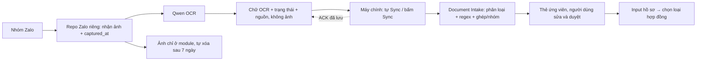

# Tiếp nhận Zalo độc lập — thiết kế tổng thể v2

**Trạng thái: DRAFT — ranh giới nghiệp vụ, gói file và quyền yêu cầu OCR lại có giới hạn đã chốt; chi tiết API còn phải duyệt, chưa triển khai runtime.**
Ngày: 24/09/2026 · Revision 5 · [MIN-89](https://linear.app/minhnotary/issue/MIN-89/spec-zalo-djoc-lap-qwen-tren-server-va-ban-giao-raw-data)

Tài liệu này ghi **lý do và ranh giới giữa hai hệ thống**. Agent bắt đầu từ [trang chỉ đường](../../../notary_v2/docs/platform/zalo-document-inbox/README.md); yêu cầu hành vi và bài thử theo [spec chính](../../../notary_v2/docs/platform/zalo-document-inbox/spec.md), giao diện đã duyệt theo `contracts/` khi MIN-92 publish. Các ví dụ API ở đây chỉ giải thích hướng thiết kế.

## 1. Luồng đã chốt

Nửa đêm, cấp trên gửi 10 ảnh vào nhóm có tài khoản Zalo phụ của văn phòng. Máy công chứng đang tắt. Module Zalo chạy độc lập, ghi lại giờ bắt tin, giữ ảnh tạm và gọi API Qwen OCR tại nơi có ảnh. Module giữ bền vững **chữ OCR, trạng thái từng ảnh và dấu vết nguồn** để máy chính lấy được vào buổi sáng. Sau Sync, **Document Intake của hệ thống công chứng** chạy phân loại, regex, bóc trường, ghép các mặt giấy tờ/người/tài sản và gợi ý nhóm hồ sơ từ raw đã nhận. Người dùng xem các thẻ ứng viên, sửa/duyệt rồi đưa vào input soạn hồ sơ.

**Hệ thống công chứng không tải hoặc lưu ảnh từ Zalo.** Người dùng mở Zalo thật để kiểm tra ảnh thủ công. Nếu máy đó có một ứng dụng Zalo riêng lưu ảnh, đó là hành vi của ứng dụng khác, ngoài phạm vi thiết kế này.

Trong giai đoạn đầu, **mặc định giả định bot đã bắt đúng toàn bộ tin/ảnh thuộc phạm vi được bật**, để làm chuẩn luồng nhận → OCR → bàn giao chữ/trạng thái/nguồn → xử lý đầu vào → duyệt. Đây là giả định thiết kế, chưa phải kết quả đo. Cách phát hiện bot bắt thiếu, đối chiếu số ảnh với Zalo thật và lấy bù được để mở trong issue riêng; không là điều kiện chặn triển khai luồng đầu tiên.

Trình tự triển khai mới: trước hết tạo repo local riêng (đề xuất `D:/zalo-intake`) để chạy thử luồng thu/OCR/bàn giao raw; chưa đưa bot lên server. Cụm “server” dưới đây chỉ vai trò module Zalo độc lập, sau này chuyển sang Windows server mà không đổi giao tiếp. Kế hoạch giao agents ở [MIN-91](../plans/2026-09-24-zalo-independent-implementation-plan.md).

## 2. Điều đã chốt và điều còn mở

| Nội dung | Trạng thái hiện tại |
|---|---|
| Chỗ chạy bot | Đã chốt: repo local độc lập trước, Windows server sau; dùng tài khoản phụ/chung của văn phòng |
| Máy công chứng | Đã chốt: một máy chính chứa dữ liệu dùng chung, có thể tắt |
| OCR | Đã chốt: server gọi API Qwen OCR; chưa xây engine OCR riêng |
| Gói bàn giao | Đã chốt: chữ OCR, trạng thái và metadata nguồn theo từng tin/ảnh/trang; không chứa kết quả đã regex/ghép từ bot, ảnh gốc, thumbnail, base64 ảnh hoặc link để hệ thống tải ảnh. |
| Lưu ảnh | Đã chốt: ảnh chỉ ở server, tự xóa sau 7 ngày; quy ước mốc tính tại mục 7 |
| Kiểm tra ảnh | Đã chốt: người dùng kiểm tra thủ công trên Zalo thật |
| Regex/phân loại/ghép | **Đã chốt: Document Intake của hệ thống công chứng sở hữu và chạy sau Sync.** Dùng chung về mặt nghiệp vụ với OCR upload thủ công và hướng MarkItDown; bot chỉ trả raw OCR và trạng thái. |
| Thời gian chính của dữ liệu | Đã chốt: lúc bot bắt được tin nhắn, ghi vào từng dòng bàn giao |
| Cách lấy gói | Đã chọn gói file `manifest.json` + `records.jsonl` + `READY.json` trong folder; máy chính tự lấy khi mở/đang chạy và có nút **Sync**. API tải/biên nhận cụ thể còn chờ contract. |
| Yêu cầu OCR lại | Đã chốt: sau khi đọc raw, Document Intake có thể yêu cầu bot thử một biến thể OCR định sẵn cho ảnh **bot đã bắt và còn lưu**. Máy chính chỉ gửi ID nguồn và loại yêu cầu, không nhận/gửi ảnh. Bot giới hạn quyền, thời hạn và số lần gọi Qwen. |
| Phát hiện/lấy bù tin ảnh bot bắt trượt | Để mở ở issue fallback, xử lý sau khi chuẩn flow |
| Kênh truyền kỹ thuật | Đề xuất cụ thể: máy chính chủ động tải qua HTTPS có xác thực, mô tả ở mục 5 |

Phạm vi tài khoản/nhóm theo [OPEN_DECISIONS B2](../../architecture/OPEN_DECISIONS.md). Không thu tài khoản cá nhân nhân viên và không tự chốt A1/A3/A4 của `notaryoffice`.

## 3. Server chứa gì, hệ thống giữ gì



Sơ đồ chốt cả nơi chạy: bot làm việc cần ảnh và bàn giao raw; Document Intake xử lý raw sau Sync. Khi chữ từ vùng ảnh chưa đủ rõ, Document Intake được gửi yêu cầu OCR lại có giới hạn theo ID ảnh; bot thực hiện tại nơi giữ ảnh, công bố **gói raw revision mới** để máy chính Sync lại. Đây là vòng bổ sung, không chuyển ảnh qua ranh giới. Bước đầu thử module local; chuyển server là việc triển khai sau.

| Nơi | Có gì | Trách nhiệm |
|---|---|---|
| Repo Zalo độc lập (local trước, server sau) | Phiên Zalo, bộ nhận, ảnh tạm, Qwen OCR, chữ/trạng thái/nguồn và API bàn giao | Nhận liên tục, gọi OCR và xử lý lại vùng/xoay ảnh khi cần bytes ảnh, giữ raw chờ máy chính; không bóc trường/người/tài sản |
| Máy công chứng: Document Intake | Bộ Sync, thư mục raw không ảnh; quy tắc phân loại, regex, bóc trường, ghép mặt/người/tài sản và nhóm tạm | Nhập raw chống trùng rồi chạy engine đầu vào Soạn hồ sơ; tạo result/revision riêng, cho người dùng sửa/duyệt và đưa vào input hồ sơ |
| Ranh giới hai repo | Gói file JSON/JSONL có phiên bản, API tải/ACK và yêu cầu OCR lại có giới hạn | Không import source của nhau, không đọc DB hoặc dùng chung đường dẫn ảnh |

Database hồ sơ vẫn thuộc hệ thống công chứng. Kho của server phục vụ tiếp nhận/OCR/bàn giao, không trở thành database hồ sơ thứ hai. Cookie Zalo và khóa Qwen ở server, không đưa vào gói.

Ở bước local, bộ khởi động riêng chạy bot và tự phục hồi lỗi tiến trình/kết nối phù hợp; không cần mở app công chứng. Tự khởi động cùng Windows và chạy không cần giữ phiên Remote Desktop là yêu cầu khi triển khai server sau. Chỉ một listener sở hữu tài khoản. OCR chậm/lỗi không làm dừng nhận ảnh mới. Lựa chọn Qwen và công nghệ tuân theo [TECH_STACK](../../architecture/TECH_STACK.md).

## 4. Dữ liệu bàn giao gồm gì

Thông tin bàn giao bắt buộc là chữ OCR, trạng thái và dấu vết nguồn bền vững theo từng tin/ảnh/trang. Hình dạng file/API chi tiết còn là draft để MIN-92 duyệt; gói mới không đòi `results.json` của bot:

```text
<package_id>/
  manifest.json       # tên gói, phiên bản, danh sách file, mã kiểm tra
  records.jsonl       # từng dòng: chữ OCR/trạng thái + nguồn + thời gian
  READY.json          # đánh dấu gói đã ghi xong
```

`JSONL` nghĩa là mỗi dòng là một đối tượng JSON hoàn chỉnh. Một ảnh có thể có nhiều trang/dòng chữ; mỗi phần giữ `message_id`, `attachment_id`, chỉ số trang/dòng và `captured_at`. Nhờ vậy còn biết chữ này thuộc ảnh nào dù không có ảnh trong máy công chứng.

Dữ liệu bắt buộc gồm: mã tài khoản/nhóm/tin/ảnh, tên nguồn hiển thị nếu có, giờ bot bắt tin, chữ thô Qwen trả về, trạng thái OCR và phiên bản OCR. Nếu đường Qwen đã được duyệt trả vị trí từng dòng chữ, giữ vị trí cùng kích thước khung tọa độ của **từng lượt OCR** và dấu vết ánh xạ xoay/cắt/đổi kích thước, để Document Intake đọc nhãn–giá trị và bố cục nhiều cột/hàng mà không cần ảnh. Vị trí của một dòng không phải tọa độ riêng của từng từ trong dòng. Nếu thiếu hoặc không kiểm chứng được vị trí, ghi rõ giới hạn và phân tích chữ như cũ; không bịa tọa độ. Nếu có nhiều lần thử OCR từ ảnh gốc/xoay/cắt vùng, giữ biến thể chữ và dấu vết bản được chọn để Document Intake truy nguồn. Trường hợp OCR lỗi có mã lỗi, không biến thành “chữ trống đã đọc thành công”. Không đưa ảnh, đường dẫn ảnh trên server hoặc URL tải ảnh vào gói. Chi tiết trường và phép thử ở [spec hành vi](../../../notary_v2/docs/platform/zalo-document-inbox/spec.md) CAP-05/CAP-11/T17; MIN-92 chốt schema, MIN-98 đo trên mẫu có nhãn trước khi bật đường nhận diện nâng cao.

Raw OCR và mọi kết quả máy đã chuẩn hóa đều chưa được người dùng xác nhận. Kết quả cần đạt sau **Document Intake trên máy công chứng**: bao nhiêu ứng viên người, giấy tờ nào đủ/chưa đủ thông tin, các trường dữ liệu và nhóm hồ sơ tạm. Quy tắc đầu ra tham chiếu [spec Zalo Inbox chính](../../../notary_v2/docs/platform/zalo-document-inbox/spec.md) và [định danh nghiệp vụ](../../../contracts/entities.md). Result/revision nội bộ do consumer tạo, giữ tham chiếu về raw đã nhập.

Quy cách nháp mới gọi gói raw là `intake.raw-package.v1`; tên/schema vẫn chờ duyệt. **Hình thức gói file/folder đã chọn.** Bản OCR mới, kể cả kết quả từ yêu cầu OCR lại, được công bố thành revision raw mới với `captured_at` gốc; gói cũ không sửa, dữ liệu người dùng đã duyệt không bị ghi đè. Phương án cũ `intake.result-package.v1`/`intake.result.v1` bàn giao kết quả đã xử lý **không còn là base contract**. Xem [quy cách bàn giao nháp](zalo-file-exchange-v1-draft.md).

## 5. Server gửi file bằng cách nào

### Đã chọn gói file; chi tiết API tải/biên nhận còn chờ duyệt

Module tạo gói file hoàn chỉnh trong folder riêng rồi cung cấp API có xác thực để máy công chứng chủ động tải. Máy chính cài một bộ Sync chạy cùng backend chính. Người dùng không phải tự tải file trong trình duyệt hay chọn nơi lưu từng lần. Cấu trúc file/folder đã chọn; tên endpoint, token và phiên bản schema còn cần MIN-92 duyệt.

1. Module ghi bền vững trạng thái và chữ OCR theo từng tin/ảnh/trang, rồi công bố gói raw. Nếu có lỗi, xuất trạng thái rõ ràng; không giấu phần chưa đọc được.
2. Khi máy chính khởi động, nối lại mạng, đến chu kỳ quét hoặc người dùng bấm **Sync**, bộ Sync hỏi server danh sách gói chưa nhận.
3. Bộ Sync tải đủ manifest, raw và dấu hoàn tất vào thư mục tạm của máy chính, kiểm tra mã kiểm tra/nội dung, rồi chuyển thành gói sẵn sàng nhập.
4. Hệ thống tự đọc gói, lưu chữ OCR/trạng thái/nguồn và trạng thái đã nhập. Chỉ khi **raw đã lưu an toàn** mới gửi **biên nhận**, còn gọi là ACK, về server. Engine xử lý raw sau đó theo hàng đợi riêng; lỗi parser không được biến thành mất gói OCR.
5. Server ghi gói đã bàn giao. Gửi lại cùng gói vẫn chỉ tạo một bản dữ liệu tại máy chính.

**Nếu máy công chứng tắt:** server giữ gói trong hàng chờ. Không cần server gọi vào một máy đang tắt, không cần mở cổng nhận trên máy nhân viên. Khi máy chính bật, nó lấy toàn bộ gói chưa ACK, kể cả gói tạo nhiều ngày trước.

**Nút Sync trên giao diện Zalo:** lấy ngay các gói dữ liệu đã công bố đang chờ trên module, hiển thị đang tải/đã nhận/lỗi và lần sync thành công gần nhất. Bấm nhiều lần không chạy chồng nhiều lượt nhập. Nếu đang sync thì dùng lại tiến độ hiện tại. Nút này không gọi chức năng lấy lịch sử hoặc phục hồi tin bot đã bắt trượt; phần đó thuộc issue fallback.

Đề xuất chu kỳ tự hỏi server khi máy chính đang chạy: 30 giây, có thể cấu hình. Dù nút Sync nằm trong giao diện Zalo, việc quét tự động thuộc backend chính, không phụ thuộc tab đó đang mở.

Địa chỉ và thông tin xác thực cấu hình khi triển khai. Khi thử hai repo trên cùng máy, cho phép HTTP có xác thực chỉ trên địa chỉ loopback (`127.0.0.1`, không nhận kết nối từ máy khác). Khi truyền qua LAN hoặc server bên ngoài, dùng HTTPS với cùng quy cách dữ liệu. HTTPS bảo vệ đường truyền; credential chỉ cho phép consumer đó đọc gói của mình, xác nhận nhận và gửi yêu cầu OCR lại hợp lệ. Không public thư mục dữ liệu/ảnh. Định dạng file và endpoint nháp tại [quy cách bàn giao](zalo-file-exchange-v1-draft.md).

### Yêu cầu OCR lại trong 7 ngày

Document Intake có thể phát hiện chữ OCR chưa đủ để đọc một trường giấy chứng nhận, ví dụ vùng ngày cấp ở chân ảnh. Nó ghi **yêu cầu có loại định sẵn** như đọc lại vùng chân hoặc thử xoay; yêu cầu trỏ `logical_id` của ảnh/trang bot đã bắt, kèm ID chống gửi lặp và lý do kỹ thuật. Không gửi ảnh, byte ảnh, tọa độ cắt tự do hoặc lệnh Qwen tùy ý. Bot xác thực consumer, kiểm ID thuộc nguồn được phép, kiểm ảnh còn trước `captured_at + 168 giờ`, giới hạn tổng số lần thử/chi phí và xử lý idempotent: gửi lại cùng yêu cầu không làm phát sinh nhiều lượt Qwen.

Bot dùng ảnh còn giữ để gọi Qwen tại chỗ. Với **job đã nhận**, thành công hoặc lỗi trong lúc chạy đều được ghi trạng thái và bot công bố **gói file raw revision mới bất biến**, gồm chữ OCR mới hoặc record lỗi liên kết yêu cầu, với `captured_at` ban đầu, `ocr_pass_id`/vùng/lần thử khi có OCR và nguồn đối chiếu. Máy chính Sync gói đó qua đường thông thường, ACK sau khi nhập raw an toàn, rồi Document Intake phân tích lại thành revision kết quả **nội bộ** khi có chữ mới. Giá trị người dùng đã duyệt chỉ được so sánh/đề xuất thay đổi, không tự ghi đè. Yêu cầu **bị từ chối trước khi tạo job** vì ảnh hết hạn/không còn, revision cũ, quyền hoặc quota chỉ giữ trạng thái bền vững theo `request_id`, không tạo gói raw giả. Bot trả mã lỗi rõ và không kéo dài hạn ảnh; không có API lấy ảnh hoặc khôi phục sự kiện bot chưa từng bắt.

### Folder trên máy chính

Bộ Sync quản lý một đường dẫn cố định theo cấu hình, ví dụ `<data_root>/zalo-intake/`. Dưới đó có `staging/`, `ready/`, `imported/`, `quarantine/` và sổ gói đã nhập. Giữ bản gói đã nhập dưới dạng file để người vận hành có thể mở lại đúng raw/status/hash khi tìm nguyên nhân lỗi nhập hoặc OCR; đây là lý do đã chọn hình thức gói file. Các gói chỉ chứa chữ OCR, trạng thái và metadata; kết quả parser do Document Intake tạo trong kho nghiệp vụ riêng. Thời hạn và giới hạn dung lượng của bản file `imported/` trên máy chính chờ MIN-102 chốt; MIN-99 thực hiện. Không tạo thư mục ảnh, không tải ảnh vào cache tạm.

Thư mục này nằm trên máy chính chứa dữ liệu dùng chung. Máy nhân viên xem kết quả qua hệ thống; không mỗi máy tự nhập một bản khác nhau. Đồng bộ dữ liệu Zalo không phụ thuộc cơ chế đồng bộ ảnh của ứng dụng Zalo khác.

## 6. Thời điểm bàn giao và ngày nhận

Tách bốn thời điểm để không nhầm dữ liệu ban đêm thành dữ liệu mới gửi buổi sáng:

| Trường | Ý nghĩa | Dùng làm gì |
|---|---|---|
| `captured_at` | **Lúc bot lần đầu bắt được tin nhắn** | Ngày/giờ chính trên mỗi dòng raw; hiển thị và gợi ý phân nhóm |
| `source_sent_at` | Giờ Zalo báo người gửi đã gửi, nếu có | Thông tin phụ để đối chiếu; không thay captured_at |
| `ocr_completed_at` / `package_ready_at` | Giờ OCR/gói hoàn tất trên server | Theo dõi tiến độ xử lý |
| `imported_at` / `acknowledged_at` | Giờ máy chính lưu thành công / server nhận biên nhận | Theo dõi bàn giao; không ghi đè ngày bot nhận |

Ví dụ:

- 00:01 ngày 24/09: bot bắt tin → `captured_at=2026-09-24T00:01:00+07:00`.
- 00:03: OCR xong, gói chờ trên server; máy công chứng đang tắt.
- 07:30: máy chính bật và tải/lưu gói → `imported_at=2026-09-24T07:30:00+07:00`.
- Giao diện vẫn xếp dữ liệu vào **24/09 lúc 00:01**, có dòng phụ “Đồng bộ lúc 07:30”.

`captured_at` được ghi bền vững ở lần bắt đầu tiên, giữ nguyên khi OCR lại, truyền lại hoặc nhập lại. Mọi attachment/trang/dòng của cùng tin kế thừa mốc đó. Tin gửi khác lúc có mốc riêng; không lấy giờ tạo gói áp chung cho cả lô. Thời gian lưu ISO-8601 có múi giờ; giao diện hiển thị giờ Việt Nam.

Bàn giao kỹ thuật hoàn thành khi máy chính đã giữ đủ raw/status/provenance và sổ nhập an toàn, rồi module ghi nhận ACK; **không chờ regex hoặc người dùng duyệt**. Nhãn “Bot nhận khi hệ thống tắt” chỉ dùng nếu lịch hoạt động máy chính chứng minh được; nếu không, chỉ hiện hai mốc nhận và sync.

## 7. Hai thời hạn lưu tách biệt

| Dữ liệu | Chính sách |
|---|---|
| Ảnh trên server | Tự xóa sau **7 ngày kể từ captured_at**. Quy ước triển khai: `image_expires_at=captured_at+168 giờ`; tải lại/OCR lại không kéo dài hạn. Dọn cả ảnh dẫn xuất/cache phục vụ OCR. |
| Chữ OCR/trạng thái/nguồn chưa ACK | Tiếp tục giữ để máy chính bật lại còn tải được; **không áp hạn 7 ngày của ảnh**. Gói bot không chứa kết quả bóc/ghép. |
| Raw/status đã ACK trên module | **Phải có thời hạn hữu hạn trước khi thử dữ liệu thật** để không tích lũy chữ giấy tờ lâu dài. MIN-92 chốt số ngày, mốc tính, quy tắc dọn, backup và bảo đảm còn đủ nguồn cho yêu cầu OCR lại trong thời hạn ảnh; hiện chưa được thử dữ liệu thật khi chưa có chính sách đó. |
| Dữ liệu máy chính đã nhập | Bản gói file `imported/` được giữ để soát lỗi; raw nội bộ phục vụ parser/review. MIN-102 chốt chính sách giữ/dọn và dung lượng của từng bản, MIN-99 thực hiện; không tự xóa theo hạn ảnh module hoặc làm mất raw cần để phân tích lại. |

Ảnh được xóa đúng hạn kể cả máy chính chưa nhận gói hoặc có yêu cầu OCR lại chưa xong. Nếu OCR đã thành công thì chữ thô vẫn dùng được sau khi ảnh bị xóa. Nếu đến hạn mà OCR còn lỗi/chưa xong, phải giữ trạng thái OCR `failed`/`source_image_expired` và metadata, không giữ ảnh quá hạn hoặc báo đã đọc xong. Yêu cầu đọc lại ảnh sau hạn nhận kết quả hết hạn rõ ràng; cách bổ sung lại ảnh hết hạn thuộc issue fallback mở.

Máy chính tắt lâu không làm đổi captured_at và không làm mất dữ liệu chờ giao. Module cần dung lượng đủ cho lượng gói tồn; thiếu dung lượng là lỗi vận hành phải báo, không tự xóa gói chưa ACK để lấy chỗ.

## 8. Thẻ thông tin và nhóm hồ sơ

Đầu ra hướng tới vẫn là các thẻ thông tin sạch: người, giấy tờ, tài sản, trường còn thiếu/xung đột; mỗi trường truy về dòng OCR và mã tin/ảnh nguồn. Giao diện không có preview ảnh Zalo. Người dùng đọc thẻ và đối chiếu ảnh trong Zalo thật khi cần.

Một lô 10 ảnh không đồng nghĩa 10 người hoặc 5 người. **Document Intake sau Sync** cần ghép thông tin cùng người, phân biệt mặt trước/mặt sau và giữ những phần chưa xác định. Trường đọc không rõ để thiếu, không tự điền bằng suy đoán. Cùng một bộ quy tắc phải phục vụ cả nguồn Zalo và upload thủ công; MarkItDown là hướng tích hợp văn bản vào lớp này nhưng hiện mới có POC riêng, chưa là runtime chung. Tránh hai parser cạnh tranh.

Nhóm hồ sơ tạm dùng `captured_at`, cùng nguồn/người gửi, album/reply nếu có. Điểm gợi ý như 95/100 là mức ưu tiên để duyệt, chưa là “đúng 95%”. Người dùng được tách/gộp/chuyển thẻ, duyệt để xử lý hoặc bỏ. Kết quả đã duyệt thuộc hệ thống công chứng; dữ liệu mới đến muộn không tự ghi đè phần đã chốt.

## 9. Fallback để mở, lỗi vận hành vẫn có trạng thái

[Issue fallback MIN-90](https://linear.app/minhnotary/issue/MIN-90/research-zalo-fallback-khi-bot-bat-thieu-va-ocr-het-han-anh) giữ mở để nghiên cứu bot bắt thiếu tin/ảnh, cách so với Zalo thật, lấy bù lịch sử, bổ sung ảnh thủ công, OCR lại khi ảnh đã hết hạn và khả năng OA liên quan. Giai đoạn đầu không xây các chức năng này, không yêu cầu người dùng xác minh đủ ảnh trước mọi lần Sync, không dùng fallback làm gate chặn chuẩn flow.

Các lỗi **đã biết trong luồng hiện tại** vẫn phải hiển thị: mất đăng nhập, không tải được một ảnh đã ghi nhận, Qwen lỗi, ảnh hết hạn trước OCR, tải gói lỗi, dữ liệu không đúng cấu trúc. Retry gửi/tải gói và chống trùng là phần giao tiếp cơ bản, không bị hoãn theo issue fallback.

Mục tiêu dài hạn bot luôn sống và bắt đủ vẫn giữ. Nếu thực tế phát hiện bắt trượt thì ghi nhận là lỗi cho issue fallback; giả định phase đầu không được trình bày thành kết quả kiểm chứng “đã thu đủ 100%”.

## 10. Khả năng bỏ Zalo hoặc chuyển nguồn

Hệ thống đọc gói raw theo contract được duyệt thay vì đọc cookie, zca-js hay DB của bot. Khi bỏ module, chữ OCR/thẻ/hồ sơ đã nhập vẫn đọc được. Chưa ACK thì phải bàn giao đủ gói hoặc ghi danh sách chưa giao trước khi dọn module. Regex/ghép/nhóm ở Document Intake có thể chạy lại từ raw OCR đã giữ, độc lập vòng đời listener.

OA sẽ là adapter mới. [Tài liệu GMF chính thức](https://oa.zalo.me/home/resources/news/_4601792943864106455) cho biết OA không được mời vào nhóm cá nhân đã tồn tại. Các API [tin nhóm gần nhất](https://developers.zalo.me/docs/official-account/nhom-chat-gmf/quan-ly/list_recent_chat) và [lịch sử một nhóm](https://developers.zalo.me/docs/official-account/nhom-chat-gmf/quan-ly/group_conversation) áp dụng cho nhóm OA quản lý. Khả năng thay thế luồng thật cần nghiên cứu riêng; chưa là phạm vi triển khai giai đoạn đầu.

Từ [2Anh/Hermes](https://github.com/luonghaianh1208/2anh-zalo-bot), phần tham khảo phù hợp là vòng đời độc lập, phiên đăng nhập lưu lại và quan sát vận hành. Luồng này không cần tích hợp bộ công cụ tự hành/AI trả lời của họ. Việc nhận giấy tờ trong nguồn bật không phụ thuộc mention/reply.

## 11. Tài liệu và các quyết định còn lại

- [Spec Zalo Inbox chính](../../../notary_v2/docs/platform/zalo-document-inbox/spec.md): hành vi, thẻ/nhóm/review và nghiệm thu phase đầu.
- [Quy cách file/API nháp](zalo-file-exchange-v1-draft.md): gói raw OCR/status/provenance, biên nhận, chống trùng, timestamp; chưa được duyệt làm contract.
- [Rà soát hiện trạng](../../../notary_v2/docs/platform/zalo-document-inbox/v2-current-state-audit.md): source baseline; không là mô tả code đã đổi theo thiết kế mới.
- [Spec v1 legacy](../../../notary_v2/docs/platform/zalo-document-inbox/spec-v1-legacy.md): giữ phê duyệt lịch sử để đối chiếu runtime.

Còn mở: schema/API cụ thể, danh mục biến thể OCR lại và mức quota, cấu hình HTTPS/xác thực và nơi đặt server, dung lượng/lưu lượng, **số ngày giữ raw trên bot sau ACK phải chốt hữu hạn ở MIN-92 trước thử dữ liệu thật**, chính sách bản `imported/` trên máy chính do MIN-102 chốt, ngưỡng grouping, issue fallback. Đã chốt: repo Zalo riêng để thử local trước, Zalo gọi Qwen gần nơi giữ ảnh và chỉ bàn giao raw OCR/status/provenance bằng gói file/folder, Document Intake chạy regex/ghép/nhóm sau Sync và có thể yêu cầu OCR lại có giới hạn theo ID khi ảnh còn, không gửi/lưu ảnh trên máy chính, ảnh module 7 ngày, nút Sync và captured_at làm mốc chính.

Contract kỹ thuật vẫn là draft; task này chỉ sửa tài liệu. Duyệt contract rồi mới triển khai qua task riêng theo rule repo. Khi chuyển runtime, chỉ một listener cho cùng tài khoản hoạt động và giữ identity tin/ảnh để không nhập trùng dữ liệu cũ.
